# v0.2: another 34% of decode speed out of the same 3090 Ti, and where it came from

*The sequel to the [200K write-up](https://github.com/JakeATX/llama-cpp-qwen-ampere) (`QWEN_AMPERE.md` in that repo). Same card, same model file, same sampler. Everything below was measured on one RTX 3090 Ti (24 GB, power-capped at 350 W) with Qwen3.8-27B ATX-IQ4_XS-M, and every number links back to a logged run.*

## The short version

Over a single 102,400-token generation at the production sampler, v0.2 decodes at **75.3 tok/s** where the v0.1 release decoded at 66.1 and stock TurboQuant+ decoded at 56.0. That is **+13.9% over v0.1 and +34.5% over stock**, on the same weights, the same 112,640-token window, the same 8-bit key cache and Turbo3 value cache, and the same seed.

Almost none of it is new attention kernels. The honest breakdown is:

1. A **64K draft-vocabulary shortlist**. The MTP head projects into a 248,320-token vocabulary once per drafted token, and it does not need to. Restricting the draft head (never the target head) to the 65,536 tokens that actually get drafted cuts that projection by 75% and costs nothing measurable in acceptance.
2. **Runtime fixes** around the speculative loop, chiefly a pinned output buffer that had been reallocating on every change of verify width, plus a flag audit that established the fused Turbo3 MMA path as the configuration every number is measured on.
3. **This round's CUDA kernel set**, which is real but small: **+0.4%** over 100,000 generated tokens, not the +5% a short-window A/B suggested.

There is also a correction to make. The v0.1 number published in the previous post was measured with the fused Turbo3 MMA path switched off, which understated it. Run the way v0.1 actually shipped, it is 66.09 tok/s, not 58.42. Both columns are in every table below, because the difference between them is the size of one environment variable and people should be able to see it.

The rest of this post walks through the ladder in the order it was built, then shows the long-generation curves.

## Where v0.1 left us

v0.1 was a kernel release: grouped verification attention, vectorized q8_0 and Turbo3 loaders, cp.async tile staging, the Gated DeltaNet ILP fix, graph retention, and a new quant. It bought +18.1% over stock TurboQuant+ across a 100K-token generation. What it did not do was look at where the time was actually going afterwards.

So the first thing this round produced was a census rather than a kernel: a per-verify-pass accounting of a 1,919 ms window on the 100K coding fixture, 34 width-4 verify passes, temperature 1, taken on v0.1 with the fused path on.

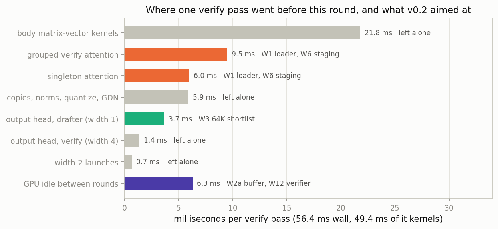

| slice of one verify pass | ms | share of the pass | targeted by |
|---|---:|---:|---|
| body matrix-vector kernels (MMVQ) | 21.8 | 44% | left alone |
| grouped verify attention | 9.5 | 19% | W1 loader, W6 staging |
| singleton attention | 6.0 | 12% | W1 loader, W6 staging |
| copies, norms, quantize, GDN | 5.9 | 12% | left alone |
| output head, drafter (width 1) | 3.7 | 7.5% | W3 64K shortlist |
| output head, verify (width 4) | 1.4 | 2.8% | left alone |
| width-2 launches | 0.7 | 1.4% | left alone |
| GPU idle between rounds | 6.3 | (11% of wall) | W2a buffer, W12 verifier |
| **kernel total** | **49.4** | | |
| **wall per pass** | **56.4** | | |

Two things fall out of that table. The body matvec is 44% of the pass and is already at the format's roofline, so it is not a target. The drafter's output head is 3.7 ms of every 56.4, which is 7.5% of the pass spent projecting one row into a quarter-million-entry vocabulary in order to pick three tokens. That number is what the rest of this release is about.

Nsight Compute on the same window said the rest was not free money either: the grouped verify kernel is ADU-limited at 60% address-unit utilization with `short_scoreboard` as its top stall reason, and the singleton vector kernel is issue-bound at 68% with 77% ALU and 83% L1. The f16 reference kernel, by contrast, sits at 95% DRAM. There is headroom in the compressed kernels, but it is instruction headroom, not bandwidth headroom, and it comes out in single-digit percentages.

## Step 1: the loader that was still reading bytes (W1)

The Turbo3 verify path still had one loader doing sub-word reads where the key path had already been widened in v0.1. Same arithmetic, wider loads, output identical. This is bookkeeping rather than a result, and it is here because it is the base the rest of the kernel work was measured against.

## Step 2: a pinned output buffer that reallocated forever (W2a)

The census found 6.3 ms of GPU idle per verify pass, about 11% of wall. Part of it was a pinned host output buffer that was sized for the last verify width and reallocated whenever the width changed. Verification width bounces between 2 and 4 depending on how many drafted tokens were accepted, so on a real workload this happens constantly. Reserving the maximum width once at context creation removes the reallocation.

Two follow-ups from the same workstream did not survive:

- **W2b**, a GPU-side greedy verifier, produced a result that had to be voided. Every benchmark request in this program sends `ignore_eos: true`, which appends EOG logit biases, which makes `common_sampler_supports_greedy_backend` return false, which means the GPU greedy path never engaged in any of those runs. The measurement was of nothing. It comes back in Step 7 with a harness that can actually reach it.
- **W2c**, a depth-4 capacity probe at 220K, ran out of memory and was recorded as a failed run rather than quietly dropped.

## Step 3: the 64K draft vocabulary (the release's largest single win)

The MTP drafter and the target model share a 248,320-token vocabulary. The target needs all of it. The drafter does not: its job is to propose tokens that the target will probably agree with, and the tokens the target actually emits in this model's traffic live in a much smaller set.

We instrumented a live server over 27,876 speculative batches, recording every token the drafter proposed (75,323 drafts, 43,988 accepted, a 0.584 accept rate) alongside a held-out corpus of 216,512 tokens spanning coding, agentic, RAG, chat, creative, document generation, STEM Q&A and mixed traffic. Then we built a static shortlist: 65,536 rows of the draft head, chosen by frequency with a hard-keep set of 792 structural tokens and a 1,024-token non-Latin reserve (1,010 of them CJK) so the map does not quietly become English-only.

The implementation is a one-line change in spirit: view the draft head's rows as one-row experts and run the projection through `ggml_mul_mat_id` over the shortlist instead of a dense matmul over the whole vocabulary. **The target head is untouched.** Only the drafter's proposals are restricted, and the target still verifies against its full distribution, so a token outside the shortlist is still generated normally; it just never gets drafted.

Head projection cost, measured on the real shapes in-server:

| draft head | microseconds per projection | change |
|---|---:|---:|
| full 248,320-token vocabulary | 1566.0 | reference |
| 64K shortlist (shipped) | 388.0 | -75.2% |
| 32K shortlist | 196.5 | -87.5% |

The 32K map is twice as fast again and is not what ships, because the coverage curve turns over:

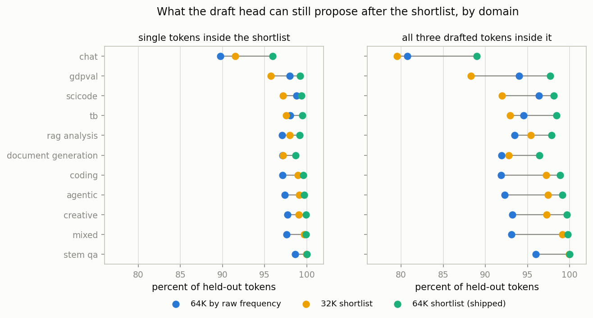

Coverage is the share of held-out tokens the shortlist can still propose at all; "all three" is the share of three-token windows where every one of the three is inside it, which is the quantity draft depth 3 actually cares about.

*Per-domain cells read as single-token coverage / all three drafted tokens inside the shortlist, percent of held-out tokens.*

| held-out set | 64K by raw frequency | 32K shortlist | 64K shortlist (shipped) |
|---|---:|---:|---:|
| all held-out, coverage | 97.39% | 98.84% | **99.59%** |
| all held-out, all three in window | 92.90% | 96.97% | **98.88%** |
| chat | 89.74 / 80.72 | 91.51 / 79.52 | **95.96 / 88.98** |
| gdpval | 97.99 / 94.01 | 95.73 / 88.28 | **99.22 / 97.71** |
| scicode | 98.78 / 96.38 | 97.16 / 91.97 | **99.35 / 98.15** |
| terminal-bench | 98.06 / 94.56 | 97.58 / 92.95 | **99.49 / 98.47** |
| RAG analysis | 97.05 / 93.48 | 97.97 / 95.38 | **99.17 / 97.87** |
| coding | 97.15 / 91.85 | 98.96 / 97.23 | **99.59 / 98.85** |
| agentic | 97.39 / 92.31 | 99.08 / 97.43 | **99.70 / 99.12** |
| document generation | 97.10 / 91.93 | 97.20 / 92.76 | **98.67 / 96.42** |

The 32K map loses 2% of three-token windows on the weakest domains, which shows up as lost acceptance and eats the projection saving. The naive "top 64K by raw frequency" column is worse than either curated map on chat and document traffic, which is the argument for the hard-keep and non-Latin reserve rather than a plain frequency cut. 64K curated is the knee.

## Step 4: how deep to draft, and why the fixtures lied

W4 said depth 4. W11 said depth 3. The release ships depth 3, and the disagreement is worth showing because it is the sort of thing that quietly ends up in a default.

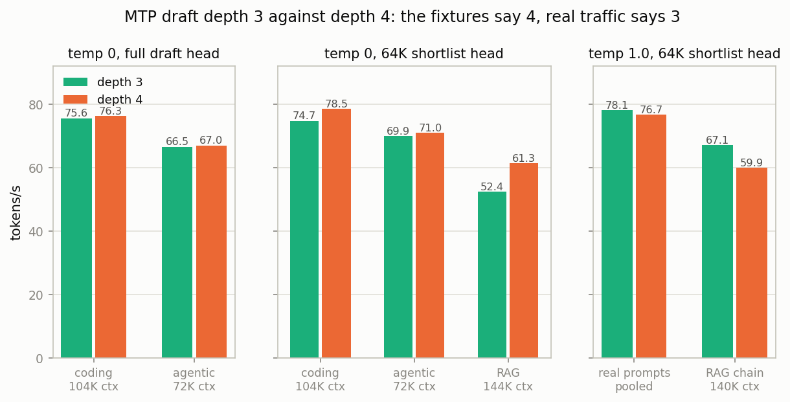

| condition | fixture | depth 3 | depth 4 |
|---|---|---:|---:|
| temp 0, full draft head | coding, 104K ctx | 75.59 | 76.27 |
| temp 0, full draft head | agentic, 72K ctx | 66.55 | 67.01 |
| temp 0, 64K shortlist | coding, 104K ctx | 74.73 | **78.51** |
| temp 0, 64K shortlist | agentic, 72K ctx | 69.89 | **70.97** |
| temp 0, 64K shortlist | RAG, 144K ctx | 52.42 | **61.32** |
| temp 1.0, 64K shortlist | real prompts, pooled | **78.11** | 76.69 |
| temp 1.0, 64K shortlist | RAG chain, 140K ctx | **67.12** | 59.94 |

Every temperature-0 fixture prefers depth 4, and once the shortlist makes a deeper draft cheap it prefers it strongly. Every temperature-1 measurement on real prompts prefers depth 3. The mechanism is straightforward once you look at acceptance: at temperature 0 the drafter and the target agree often enough that the fourth slot is usually accepted, so a deeper draft is nearly free tokens. At temperature 1 the fourth slot is accepted about half the time, and the wasted verify width costs more than the occasional extra token.

Depth 4 also lowered acceptance across the board on real traffic (0.549 pooled at depth 4 against 0.607 at depth 3), so this is not a wash that happens to fall one way. The 140K RAG chain row is content-confounded across depths, since the two depths sample different continuations at temperature 1.0; runs within an arm were byte-identical, and it agrees in direction with the real-prompt pool, which is why it is quoted alongside rather than on its own. The production sampler decides the default, and the production sampler is temperature 1.0, top-k 20, top-p 0.95.

## Step 5: this round's kernels, honestly reported (+0.4%)

W6 and W7 produced an exact CUDA kernel set on top of v0.1: further staging work on the compressed load path and instruction-level cleanup in the grouped verify kernel, all of it output-identical. Measured as a short-window A/B at 100K context it was **+4.98% pooled, p = 0.029**. Measured as a 102,400-token generation against the same v0.1 build with the same seed, it is **+0.44%** (66.38 against 66.09 tok/s).

We are reporting the second number. The short-window result is not fabricated and the kernels are not slower, but a 100K-generation run is the metric this program ships on, and it does not reproduce the short-window effect. The most likely explanation is that the short-window A/B ran at a fixed 100K context depth while the generation run spends most of its tokens shallower than that, and the kernels help most where attention's share of the round is largest. Either way, **nearly all of v0.2's gain over v0.1 is the shortlist plus the runtime work, not this round's kernels.**

W8 was a full screen of the runtime's environment flags against the shipped defaults. It changed no default, which is the result.

## Step 6: the adaptive hot tail that did not pay (W10, W11)

If a static 64K shortlist is good, an adaptive one should be better: append 6,144 adaptive slots to the static 65,536, refilled from recently drafted tokens, so the drafter can chase a document's local vocabulary. It was implemented, and it was rejected on two independent measurements.

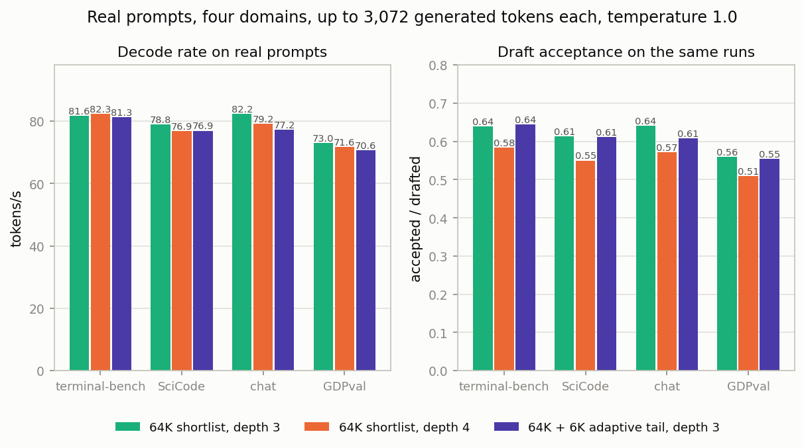

| domain | 64K shortlist, depth 3 | 64K shortlist, depth 4 | 64K + 6K adaptive tail, depth 3 |
|---|---:|---:|---:|
| terminal-bench | 81.65 (acc 0.638) | 82.26 (acc 0.583) | 81.30 (acc 0.644) |
| scicode | 78.85 (acc 0.613) | 76.89 (acc 0.550) | 76.90 (acc 0.611) |
| chat | 82.23 (acc 0.640) | 79.23 (acc 0.572) | 77.20 (acc 0.607) |
| gdpval | 73.03 (acc 0.560) | 71.64 (acc 0.510) | 70.64 (acc 0.555) |
| **pooled** | **78.11 (acc 0.607)** | 76.69 (acc 0.549) | 76.00 (acc 0.602) |

The hot tail is -2.7% pooled on real prompts, and an earlier ABBA run on the coding fixture had it at -4.0%. Acceptance is essentially unchanged (0.602 against 0.607), so it is not proposing better tokens; it is just making the indexed projection wider and less cache-friendly for no return. The static map ships and the adaptive path does not.

## Step 7: an opt-in greedy verifier (W12)

With W2b's measurement voided, the GPU greedy verifier was rebuilt and measured on a harness that can actually reach it. It moves the greedy accept/reject comparison onto the GPU, removing a synchronous readback per verify pass.

It is **+0.6% and opt-in**, behind `LLAMA_MTP_GPU_VERIFY=greedy`, and it is off by default. It is eligible only under plain greedy sampling (top-k 0, top-p 1) and any logit bias, including the EOG biases that `ignore_eos` installs, disqualifies it. A feature that only helps greedy users is not a default in a release whose headline is a temperature-1.0 sampler. Over 102,400 greedy tokens it produced byte-identical output to the same build with the verifier off, which is the reason to ship it at all: it is exact, and greedy users can have the 0.6%.

## A correction to the v0.1 number

The v0.1 write-up quoted a decode rate that was measured with `GGML_Q8_TURBO3_MMA_FUSED` unset. The fused Turbo3 MMA path is what v0.1 shipped and what its documentation tells you to set, so that column understated the release it was describing by about 13%.

| v0.1 build, 102,400-token generation, temperature 1.0 | tok/s |
|---|---:|
| fused MMA path off (the number previously published) | 58.42 |
| fused MMA path on (v0.1 as documented) | 66.09 |

Every comparison in this post uses the second row as the v0.1 baseline. The first row is kept in the figures because it is the same binary and it shows exactly what that one environment variable is worth.

## What it adds up to

One 685-token prompt, 102,400 generated tokens with EOS ignored, a 112,640-token window, seed 6100, temperature 1.0 with top-k 20 / top-p 0.95 / min-p 0, MTP depth 3, checkpointed every 5,000 tokens. Rates are the server's own reported decode rate.

| build | tok/s | vs stock | vs v0.1 | draft acceptance |
|---|---:|---:|---:|---:|
| stock TurboQuant+ (1208c5956) | 55.98 | reference | | 0.660 |
| v0.1, fused MMA off | 58.42 | +4.4% | | 0.660 |
| v0.1 as documented (26e7bc523, FUSED=1) | 66.09 | +18.1% | reference | 0.660 |
| W7 kernels only (43651b47e) | 66.38 | +18.6% | +0.4% | 0.660 |
| **v0.2 (4017a1af4, shortlist + runtime)** | **75.29** | **+34.5%** | **+13.9%** | 0.680 |

Stock, both v0.1 arms and the W7 arm produced **byte-identical text** on this run: the same 95,576 drafted tokens, the same 63,082 accepted, the same per-slot acceptance histogram, and the two arms that recorded a content hash match at `ff5d845b`. Those four are therefore a pure speed comparison with content held fixed.

**v0.2 is not.** The shortlist changes which tokens get drafted, so different tokens get accepted, so the sampled text diverges. Its 0.680 acceptance against 0.660 is partly a better draft distribution and partly a different, easier continuation. That matters for the tail specifically, and the next section says where.

## Speed over long generations

The single number above is a cumulative average. The curves show how the rate moves as the generation gets long, which on this model is where configurations separate.

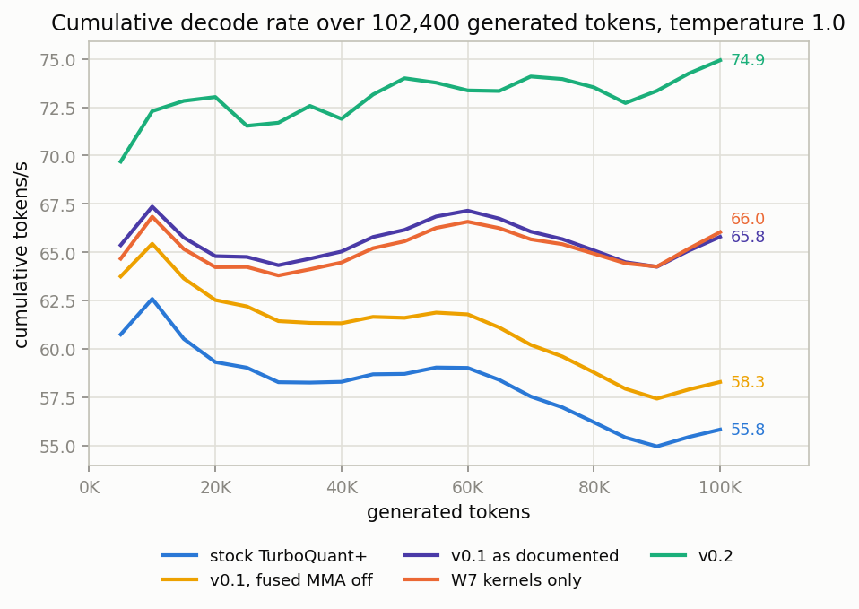

| generated tokens | stock | v0.1 fused off | v0.1 documented | W7 kernels | v0.2 |
|---:|---:|---:|---:|---:|---:|
| 20,000 | 59.3 | 62.5 | 64.8 | 64.2 | 73.0 |
| 40,000 | 58.3 | 61.3 | 65.0 | 64.5 | 71.9 |
| 60,000 | 59.0 | 61.8 | 67.2 | 66.6 | 73.4 |
| 80,000 | 56.2 | 58.8 | 65.1 | 64.9 | 73.5 |
| 100,000 | 55.8 | 58.3 | 65.8 | 66.0 | 74.9 |

*Cumulative tokens/s at the client's 5,000-token checkpoints. These sit slightly below the server-reported rates in the table above (74.9 against 75.29, 65.8 against 66.09, 55.8 against 55.98) because the client's figure includes the checkpoint pauses and the final 389 tokens fall outside the last checkpoint. Same runs, measured from the other side.*

The v0.1 documented and W7 curves sit on top of each other for the whole run, which is the +0.4% from Step 5 drawn out to 100,000 tokens. The gap that matters is v0.2 against everything else, and it widens rather than closing.

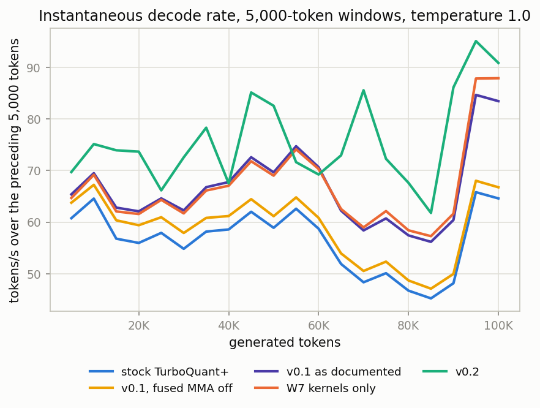

| window ending at | stock | v0.1 fused off | v0.1 documented | W7 kernels | v0.2 |
|---:|---:|---:|---:|---:|---:|
| 20,000 | 56.0 | 59.4 | 62.1 | 61.6 | 73.6 |
| 40,000 | 58.6 | 61.2 | 67.8 | 67.0 | 67.5 |
| 60,000 | 58.7 | 60.8 | 70.6 | 70.3 | 69.2 |
| 80,000 | 46.7 | 48.7 | 57.4 | 58.4 | 67.6 |
| 85,000 (worst window, all arms) | 45.2 | 47.1 | 56.2 | 57.3 | 61.8 |
| 100,000 | 64.6 | 66.7 | 83.4 | 87.9 | 90.8 |

What the curve says: every arm has a rough stretch between 65,000 and 90,000 generated tokens, and stock and the fused-off v0.1 fall into the **45 to 52 tok/s** band there while v0.1 as documented bottoms out at 56.2, W7 at 57.3, and v0.2 at 61.8. **Part of that is v0.2 generating different text.** The first four arms are producing the identical token stream, so their dip is a property of that stream at that depth; v0.2's stream is its own, and an easier continuation would show up exactly this way. We are not claiming the whole tail advantage is mechanism. What is mechanism is the +18.1% between stock and v0.1-as-documented and the +0.4% between v0.1 and W7, both of which are measured with the content held byte-identical.

**Why every arm speeds up in the last 10,000 tokens.** It is not the hardware. Across the whole run the SM clock stays between 1,650 and 1,860 MHz, the card sits at 65 to 66 C, and board power is pinned at about 348 W from the first checkpoint to the last. It is the text. The prompt is a long reasoning task: the model spends roughly the first 90,000 tokens in free-form reasoning prose, where the MTP head's proposals are accepted less often, and then writes the final structured answer, R code plus a test harness, in the last stretch, which is far more predictable. Cutting the stock-identical output into 20 equal chunks, the zlib compression ratio runs 0.33 to 0.40 for chunks 1 through 18 and then drops to 0.238 and 0.268; the fraction of distinct 6-grams runs 0.94 to 1.00 and then drops to 0.911 and 0.862. The per-window rate follows: 56 to 62 tok/s through 65,000 to 90,000 tokens, then 84.6 and 83.4. The smaller bump at 45,000 to 60,000 tokens (72 to 75 tok/s, distinct 6-grams 0.94 to 0.98) is the same effect on interim code drafts.

Context length itself costs surprisingly little on this model, because only 16 of its 65 layers hold a KV cache and that cache is q8_0 keys with Turbo3 values. Acceptance-rate swings driven by what the model is writing dominate the curve. The practical consequence for anyone reading these numbers: **quote the cumulative rate over the whole 100,000 tokens, not the last window.** The absolute level moves with the content, but the ranking between arms is stable at every single checkpoint.

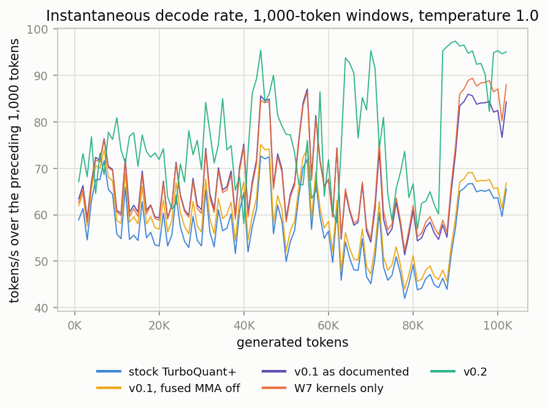

The per-1,000-token view is the same data at higher resolution and is included because it shows the texture the 5K windows average away: the swings are draft acceptance moving with the local content, not a smooth decay with depth. All five arms wobble together through the first 60,000 tokens, which is what you expect when four of them are decoding the same tokens.

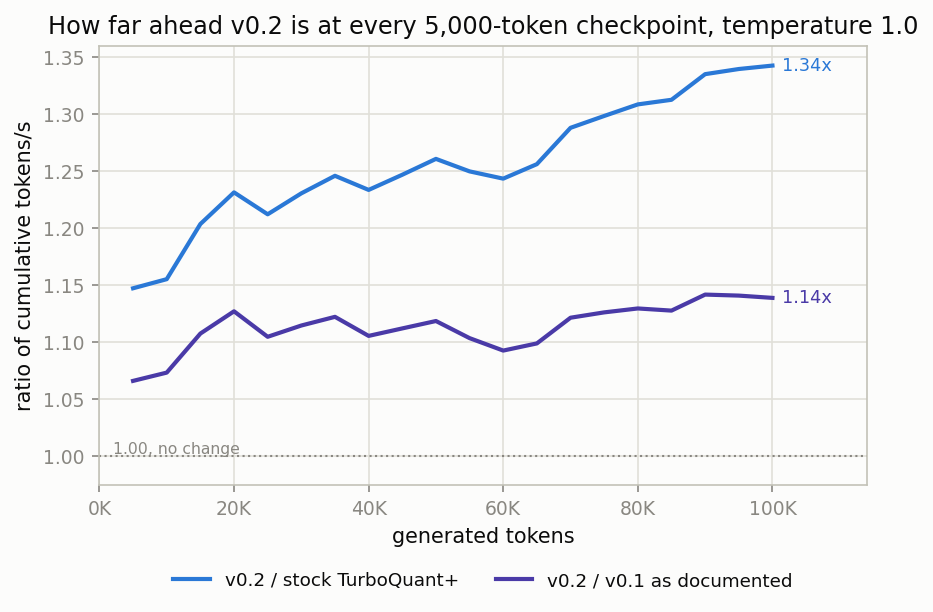

| checkpoint | v0.2 / stock | v0.2 / v0.1 documented |
|---:|---:|---:|
| 5,000 | 1.15x | 1.07x |
| 20,000 | 1.23x | 1.13x |
| 40,000 | 1.23x | 1.11x |
| 60,000 | 1.24x | 1.09x |
| 80,000 | 1.31x | 1.13x |
| 100,000 | **1.34x** | **1.14x** |

The ratio against v0.1 is flat between 1.07 and 1.14 across the whole run, which is the shape you want from a change that makes every draft round cheaper rather than one that helps at a particular depth. The ratio against stock climbs, because stock is also missing the fused MMA path.

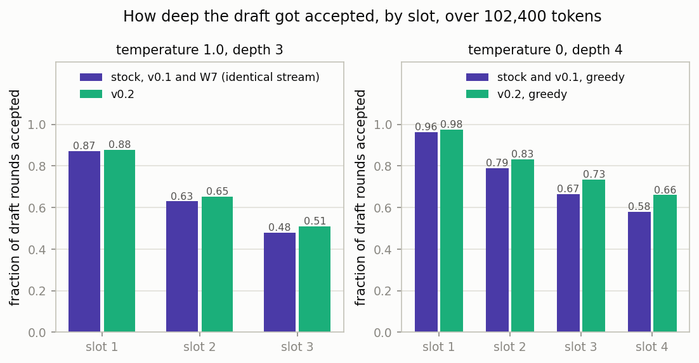

| draft slot | temp 1.0 depth 3, stock / v0.1 / W7 | temp 1.0 depth 3, v0.2 | temp 0 depth 4, stock and v0.1 | temp 0 depth 4, v0.2 |
|---|---:|---:|---:|---:|
| slot 1 | 0.871 | 0.879 | 0.962 | 0.975 |
| slot 2 | 0.630 | 0.652 | 0.789 | 0.833 |
| slot 3 | 0.479 | 0.509 | 0.666 | 0.733 |
| slot 4 | not drafted | not drafted | 0.580 | 0.660 |

The shortlist does not lower acceptance, which was the risk. It raises it slightly at every slot, and more at the deep slots than the shallow ones. That is consistent with the shortlist removing low-probability long-tail proposals that were never going to be accepted anyway.

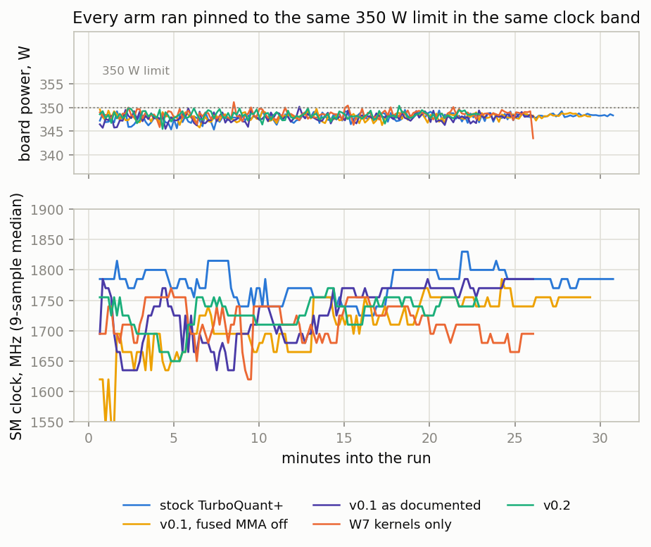

| arm | median board power | peak power | median SM clock | median temperature | wall time |
|---|---:|---:|---:|---:|---:|
| stock TurboQuant+ | 348.0 W | 349.5 W | 1,785 MHz | 66 C | 30.8 min |
| v0.1, fused MMA off | 348.0 W | 349.7 W | 1,725 MHz | 66 C | 29.4 min |
| v0.1 as documented | 347.9 W | 350.1 W | 1,755 MHz | 66 C | 26.1 min |
| W7 kernels only | 348.5 W | 351.1 W | 1,710 MHz | 65 C | 26.1 min |
| v0.2 | 348.4 W | 350.3 W | 1,740 MHz | 66 C | 22.9 min |

Every arm ran pinned against the same 350 W limit in the same clock band at the same temperature, and the faster arms ran at *slightly lower* clocks, not higher. Nothing here is a thermal or power artifact; the differences are work removed, not headroom found.

### Greedy decoding, for greedy users

This is the temperature-0 comparison, not the headline. It is here because greedy decoding is a real way to run a model and because it is the only condition under which the opt-in verifier is eligible. Same protocol, same prompt, same seed, MTP depth 4.

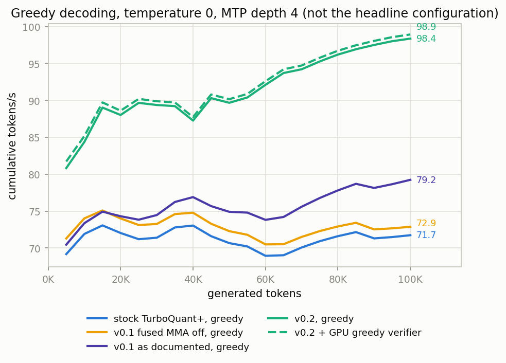

| build, greedy | tok/s | vs stock | acceptance | text |
|---|---:|---:|---:|---|
| stock TurboQuant+ | 71.84 | reference | 0.749 | sha `6d938081` |
| v0.1, fused MMA off | 72.95 | +1.5% | 0.749 | identical, `6d938081` |
| v0.1 as documented | 79.49 | +10.6% | 0.749 | identical, `6d938081` |
| v0.2, verifier off | 98.54 | +37.2% | 0.801 | diverges, `cac2e188` |
| v0.2 + GPU greedy verifier | **99.10** | **+38.0%** | 0.801 | identical to the row above |

Cumulative at the checkpoints: 72.0 / 73.0 / 69.0 / 71.6 / 71.7 for stock at 20K through 100K, 74.3 / 76.9 / 73.8 / 77.8 / 79.2 for v0.1 as documented, 88.0 / 87.3 / 92.1 / 96.2 / 98.4 for v0.2, and 88.6 / 87.7 / 92.6 / 96.7 / 98.9 with the verifier.

Two notes. Stock, both v0.1 arms and their 308,570 characters of output are hash-identical here, so the +10.6% from the fused path is measured with content held fixed. v0.2 diverges from stock at about 3,400 tokens, on near-ties where the shortlist changes which of two nearly equal candidates gets drafted, so its +24.0% over v0.1 is partly content. The verifier row is the clean one: byte-identical to the row above it over 102,400 tokens, +0.57%, which is within noise and is why it ships opt-in rather than on.

### Capacity

The shortlist and depth 4 together add about 150 MiB at a populated 220,000-token context.

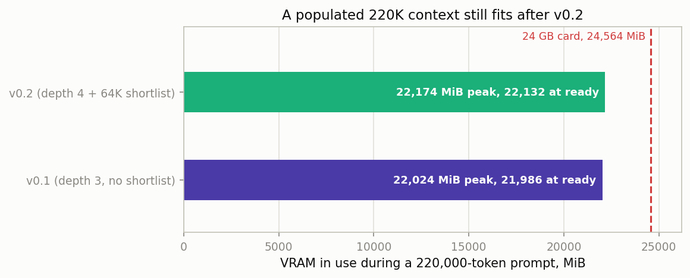

| configuration, 220,000-token prompt in a 225,280-token window | ready | peak |
|---|---:|---:|
| depth 3, no shortlist (W7) | 21,986 MiB | 22,024 MiB |
| depth 4 + 64K shortlist (W9) | 22,132 MiB | 22,174 MiB |

Read that as an upper bound on the shortlist's cost rather than a measurement of it: the two runs differ in draft depth as well as in the map, and no capacity run isolated the map alone. Either way a populated 220K context sits about 2.4 GiB under the ceiling on a 24 GB card, which is where v0.1 left it.

## What did not work

- **The adaptive hot-tail vocabulary (64K static plus 6,144 adaptive slots).** -4.0% on an ABBA coding fixture, -2.7% pooled on real prompts, with acceptance unchanged. Rejected on two independent measurements.
- **MTP depth 4 as a default.** Every temperature-0 fixture wanted it, by up to +17% on RAG. Real prompts at temperature 1.0 wanted depth 3, by 1.9% pooled and 12% on a long RAG chain (that one content-confounded), with 0.058 more acceptance. The fixtures were measuring a regime the production sampler does not run in.
- **The 32K shortlist.** Twice as fast per projection as the 64K map (196.5 microseconds against 388.0) and it loses 2% of three-token windows on chat and document traffic. The projection saving does not survive the lost acceptance.
- **The first GPU greedy verifier measurement (W2b).** Every request in the harness sent `ignore_eos: true`, which installs EOG logit biases, which makes the greedy backend ineligible. The path never ran. The result was voided rather than published, and the feature was re-measured from scratch.
- **A depth-4 capacity probe at 220K (W2c)** ran out of memory and is logged as a failed run.
- **This round's kernels as a headline.** +4.98% pooled at a fixed 100K context with p = 0.029, +0.44% over a 102,400-token generation. The generation run is the one we ship on.
- **Draft KV at f16 (W5)** was specified and never run. It is held, not concluded, and nothing in this release depends on it.

## Replicate it

**Runtime.** Fork: https://github.com/JakeATX/llamAmpere, branch `main`, commit `1b9b70be1`. Based on https://github.com/TheTom/llama-cpp-turboquant. The 100,000-token measurements above were taken on the immediately preceding tree; the shipped tree adds the opt-in greedy verifier and a pinned-output-buffer fix and changes no default. The two were checked against each other before release: same prompt, same seed, temperature 1.0, depth 3, shortlist on, 8,192 generated tokens, **byte-identical output** (sha `498e56de`, 7,740 drafted and 4,184 accepted on both), 68.74 against 69.14 tok/s.

```bash
git clone -b main https://github.com/JakeATX/llamAmpere.git
cd llamAmpere
cmake -S . -B build-sm86 -DCMAKE_BUILD_TYPE=Release -DGGML_CUDA=ON -DGGML_CUDA_FA=ON \
      -DCMAKE_CUDA_ARCHITECTURES=86 -DGGML_NATIVE=ON
cmake --build build-sm86 -j8 --target llama-server
```

**Model.** Unchanged from v0.1: ATX-IQ4_XS-M, https://huggingface.co/jakeatx/Qwen3.8-27B-ATX-IQ4_XS-M-GGUF. IQ4_XS base, M-pattern mix, 4.56 bits per weight, 65 layers (48 Gated DeltaNet, 16 full attention, 1 MTP).

**Server.** v0.1's command plus the shortlist. The map ships in the repo at `docs/mtp-vocab/atx_65536.txt`; it is a plain text file with a `llama-mtp-vocab-v1 248320 65536` header and one token id per line, and it is specific to this model's vocabulary.

```bash
GGML_Q8_TURBO3_MMA_FUSED=1 ./build-sm86/bin/llama-server -m Qwen3.8-27B-ATX-4-XS.gguf \
  -c 112640 -b 4096 -ub 1024 -t 8 -tb 8 -ngl 99 -fa on -ctk q8_0 -ctv turbo3 \
  --parallel 1 --jinja --fit off \
  --spec-type draft-mtp --spec-draft-n-max 3 --spec-draft-p-min 0.45 \
  --spec-draft-type-k q8_0 --spec-draft-type-v turbo3 \
  --spec-draft-vocab-map docs/mtp-vocab/atx_65536.txt
```

`GGML_Q8_TURBO3_MMA_FUSED=1` is worth 13% and is the single most important line in that block. Draft depth stays at 3; raise it to 4 only if you actually run greedy. Documentation for the shortlist, including how to regenerate the map for a different vocabulary or a different traffic mix, is in `docs/mtp-vocabulary-shortlist.md`.

**Optional, greedy only.** `LLAMA_MTP_GPU_VERIFY=greedy` moves the accept/reject comparison onto the GPU for about +0.6%. It is eligible only under plain greedy sampling (`top_k 0`, `top_p 1`, no logit bias) and silently stays disabled otherwise, including whenever `ignore_eos` is set. It is exact where it runs: byte-identical over 102,400 greedy tokens.

Sampling used for every headline number above: temperature 1.0, top-k 20, top-p 0.95, min-p 0. Single-user configuration, `--parallel 1`, one request at a time.

**Notes for 3090 (non-Ti) owners.** Same SM86 architecture, same 24 GB, so the kernels and the capacity numbers carry over. Memory bandwidth is about 7% lower (936 against 1008 GB/s), so expect decode a few percent below the tables. Our card ran at a 350 W power limit throughout, and the traces above show every arm pinned there.

## Method notes, for the skeptical

- **The headline is temperature 1.0 with the production sampler.** Temperature-0 runs in this post are exactness checks or the labelled greedy section. No greedy-only feature is a default, which is why the GPU verifier is behind an environment variable despite being free and exact.
- **Byte-identity is checked, not assumed.** At temperature 0 the stock, fused-off v0.1 and documented v0.1 arms carry the same content hash `6d938081` over 308,570 characters, and the two v0.2 greedy arms carry `cac2e188`. At temperature 1.0 the two arms that recorded hashes match at `ff5d845b`; the stock and fused-off arms on that run predate hash recording and their identity rests on matching drafted, accepted and per-slot acceptance counts (95,576 / 63,082 / 27,764-20,060-15,258), which is strong but is not a hash.
- **v0.2's temperature-1.0 text is not the same text.** Any comparison involving v0.2 mixes mechanism with content. Comparisons among stock, v0.1 and W7 do not, and those are the ones quoted as clean kernel or flag effects.
- **Build-vs-build runs alternated in order with a 60 s cooldown**, because back-to-back server runs on this card show a 4-7% order effect. Short-window A/Bs use the ABBA protocol; the 100,000-token runs are single runs per arm and are quoted with their per-window curves so their variance is visible rather than summarized.
- **The shape of the curve is content, not thermals.** Every arm accelerates over the last 10,000 tokens because the model stops reasoning in prose and starts emitting structured code, which the draft head predicts far better. Clocks, temperature and board power are flat across the whole run in every arm's `gpu.csv`. Cumulative rates over the full 100,000 tokens are the comparable quantity; a last-window figure would flatter every arm by 10 to 20 tok/s.
- **Client-side and server-side rates differ slightly and both are shown.** Tables quote the server's reported decode rate; the figures plot the client's cumulative rate at 5,000-token checkpoints, which includes checkpoint pauses and drops the final 389 tokens. The gap is under 0.6% everywhere.
- **The one result we downgraded on our own measurement is this round's kernel set**, from +4.98% at a fixed 100K context to +0.44% over a 100,000-token generation. Both runs are in the data. Every rejected experiment, including the voided W2b greedy measurement and the failed W2c capacity probe, has a hypothesis file, raw data, an analysis and a ledger row alongside the ones that shipped.
