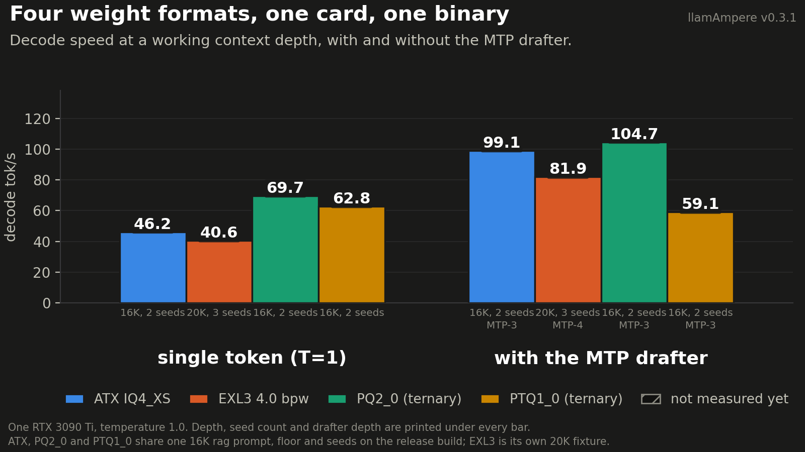
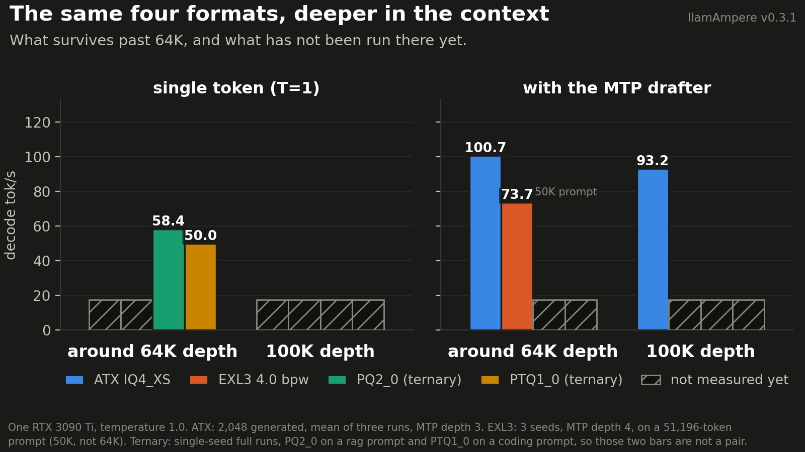
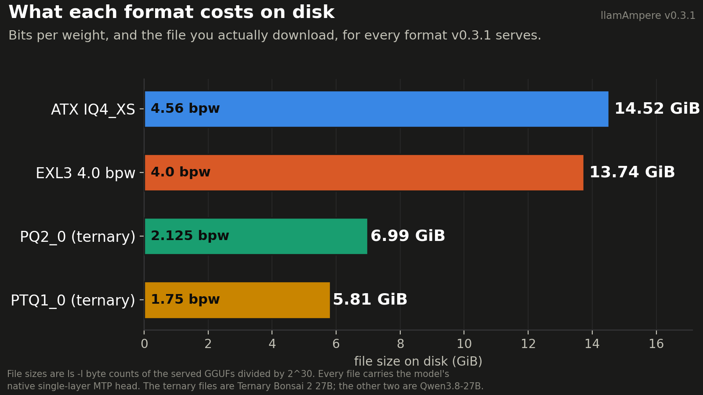
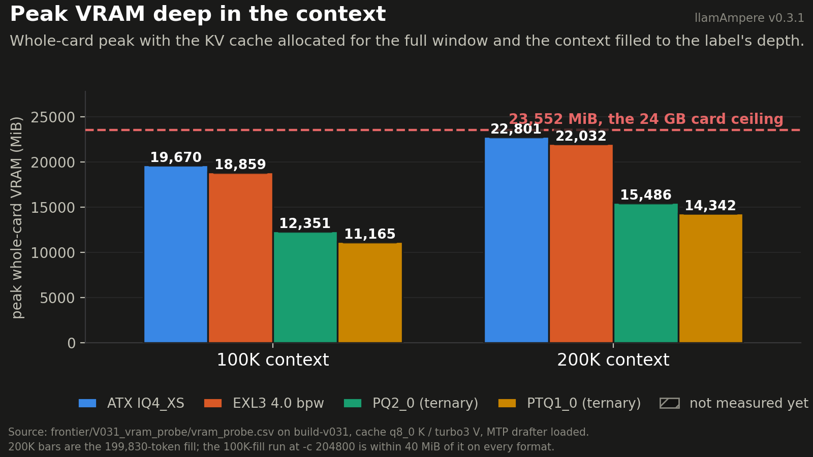
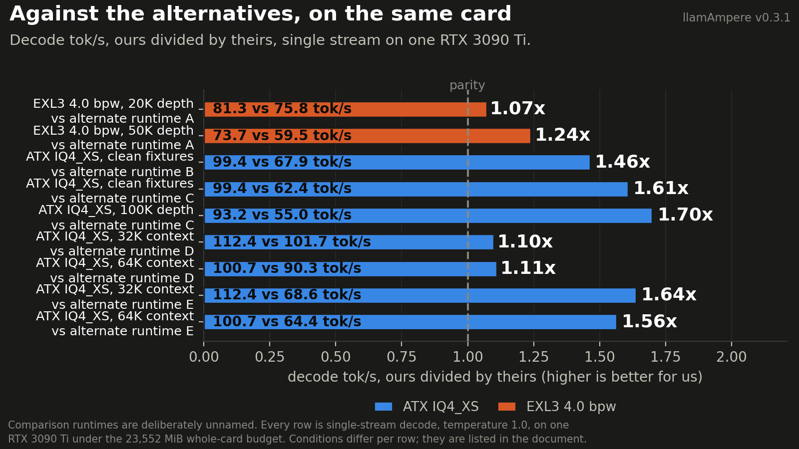
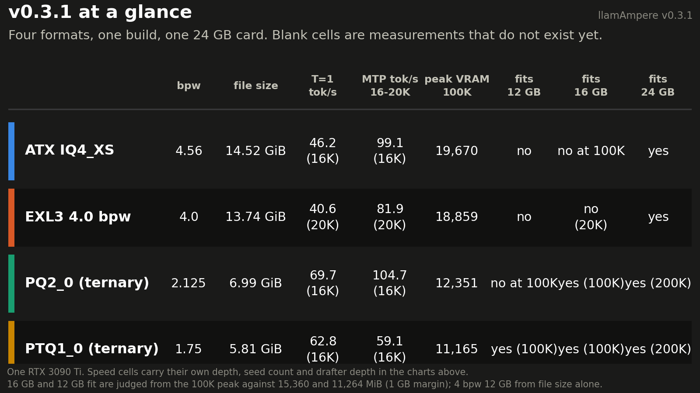

# llamAmpere v0.3.1 highlights

v0.3.1 is a format release. v0.3 made one quant fast on one card; v0.3.1 widens the fork to three more
weight formats and leaves the v0.3 decode stack underneath them untouched. EXL3 (exllamav3 trellis)
weights are now GGUF-native ggml types with an SM86 CUDA decode path, so an exllamav3 checkpoint can be
repacked and served by `llama-server` with no Python and no second runtime. Prism ML's Ternary Bonsai 2
27B runs on CPU and CUDA, with SM86 decode kernels for both of its ternary containers. The IQ3 MMVQ path
gains an opt-in shared-memory codebook. Everything below was measured on one RTX 3090 Ti at 350 W under
a 23,552 MiB whole-card VRAM budget, at temperature 1.0 unless a chart says otherwise. Charts are
generated from [highlights_data.json](highlights_data.json), where every plotted number carries the file
it was read out of; a cell that has no measurement yet is drawn hatched and labelled `pending` rather
than filled with a guess.

## 1. Four weight formats, one card, one binary



At a working context depth the same build serves four very different formats at usable speed. The MTP
drafter is worth 1.5x to 2x on PQ2_0 and EXL3, but not on PTQ1_0: at temperature 1.0 its depth-3 drafted
run is slower than its single-token run (59.1 against 62.8 tok/s), because at 0.55 acceptance the
1.75-bit verify step costs more than the accepted tokens buy back. Leave the drafter off for PTQ1_0 at
temperature 1.0, or use PQ2_0 when the 1.1 GB fits. PQ2_0 reaches 104.8 tok/s from a 6.99 GiB file,
level with ATX IQ4_XS at 99.1 tok/s within the seed spread and from a file less than half the size, and
EXL3 4.0 bpw reaches 81.9 tok/s with three seeds behind it. The ATX and both ternary cells
are the same 16K rag prompt, floor and seeds on the release build; both EXL3 cells were measured at 20K
on their own fixture, three seeds each, so read each bar with the tag printed underneath it.

Conditions: one RTX 3090 Ti, temperature 1.0, single stream. ATX 99.1 tok/s is the same 16,000-token rag
prompt, floor and seeds as the ternary cells, MTP depth 3 with `p-min 0`, on the release build, sd 4.62
(the v0.3 build on the identical cells gave 93.7); its single-token bar is the same cells without the
drafter, 46.3 tok/s, sd 0.31, so the drafter is worth 2.1x on ATX. EXL3 40.6 tok/s single-token
is a full run on the release build without the drafter: a 20,469-token prompt, seeds 7300/7301/7302,
`n_predict` 20,480, EOS honoured, sd 0.15; 81.9 tok/s is the same prompt, seeds and cap with MTP depth
4 and `p-min 0`, sd 0.82, acceptance 0.61 to 0.63, so the drafter is worth 2.0x on EXL3 (the earlier
build-exl3 run of the same cells gave 81.27). PQ2_0 is a 16,000-token rag prompt, two seeds, full runs with a 5,000-generated-token
floor, on the release build, sd 0.37 at T=1 and 3.34 with MTP depth 3 (acceptance 0.56 to 0.59). PTQ1_0 at T=1 is the same rag prompt and floor on the
release build, two seeds, sd 0.27; with MTP depth 3 it is 59.1 tok/s on the same cells, sd 0.96.

Sources: `EX8_bonsai_mtp/results_atx_ab/v031/CB.rag_analysis.c16000.s{7300,7301}.json` and
`CM.rag_analysis.c16000.s{7300,7301}.n3.json` (ATX); `EX5_depth_bench/results_v031/A1.20k.s{7300,7301,7302}.json`
and `A.20k.s{7300,7301,7302}.json` (EXL3 single-token and MTP-4, release build; the build-exl3 run is
`docs/exl3.md` line 244 with JSONs in `EX5_depth_bench/results/`);
`EX8_bonsai_mtp/results/CB.rag_analysis.c16000.s{7300,7301}.json` and
`EX8_bonsai_mtp/results_pq2/CM.rag_analysis.c16000.s{7300,7301}.n3.json` (PQ2_0);
`EX8_bonsai_mtp/results_v031_ptq1/CB.rag_analysis.c16000.s{7300,7301}.json` and
`CM.rag_analysis.c16000.s{7300,7301}.n3.json` (PTQ1_0).

## 2. The same four formats, deeper in the context



Depth is where this fork was built to live, and it is also where the measurement matrix is thinnest.
ATX holds 100.7 tok/s at 64K and 93.16 tok/s at 100K, which is a 17 percent fall from its 32K figure
across a 3x longer context. EXL3 loses 9 percent going from a 20K to a 51,196-token prompt, and
acceptance is flat across that span (cell means 0.608 to 0.642), so the drop is per-step engine overhead
rather than drafting. The ternary containers have single-seed cells at 64K and nothing at all at 100K.

Conditions: one RTX 3090 Ti, temperature 1.0. ATX: 2,048 generated, mean of three runs, MTP depth 3.
EXL3: three seeds, MTP depth 4, on a 51,196-token prompt, which the chart labels 50K rather than folding
into the 64K group. Ternary: single-seed full runs under the 5,000-generated-token floor, PQ2_0 on a rag
prompt and PTQ1_0 on a coding prompt, so those two bars are not a pair. Every 100K cell except ATX is
pending, and the PQ2_0 MTP cell at 64K is pending because all three attempted runs stopped under the
floor and are marked invalid.

Sources: `docs/llamampere-v0.3/ARTICLE.md` line 528 and `QWEN_AMPERE.md` lines 29 and 231 (ATX);
`docs/exl3.md` line 245 with `EX5_depth_bench/results/A.50k.s{7300,7301,7302}.json` (EXL3);
`EX8_bonsai_mtp/results_pq2/CB.rag_analysis.c64000.s7301.json` and
`EX8_bonsai_mtp/results/CB.coding.c64000.s7300.json` (ternary).

## 3. What each format costs on disk



The four formats span 1.75 to 4.56 bits per weight, which is 5.81 to 14.52 GiB of file for the same
class of 27B model. EXL3 at 4.0 bpw is 0.78 GiB smaller than ATX IQ4_XS at 4.56 bpw and buys quality per
byte rather than speed. The ternary containers are less than half the size of either: PQ2_0 trades about
1.1 GB of VRAM against PTQ1_0 for a byte-permute unpack instead of a multiply chain, and the two hold
bit-identical ternary values and scales, so choosing between them is a packing decision and not a
quality one.

Conditions: `ls -l` byte counts of the exact GGUFs that were measured, divided by 2^30. Every file here
carries the model's native single-layer MTP head, which is why the two Bonsai files are larger than the
official Prism checkpoints (PTQ1_0 5,946,648,928 bytes and PQ2_0 7,206,168,928 bytes without the head).
The EXL3 file is the `--fuse` conversion, the one the measurements used. The ternary files are Ternary
Bonsai 2 27B; the other two are Qwen3.8-27B.

Sources: `QWEN_AMPERE.md` line 24 (4.56 bpw); `docs/exl3.md` line 92 (EXL3_4 bulk, EXL3_6 output head);
`docs/bonsai2.md` (official checkpoint sizes); `ls -l` on
`models/atx4xs/Qwen3.8-27B-ATX-4-XS.gguf`, `models/exl3-4.0bpw-gguf/Qwen3.8-27B-EXL3-4.0bpw.gguf`,
`models/bonsai2/Ternary-Bonsai-2-27B-PQ2_0-MTP.gguf` and
`models/bonsai2/Ternary-Bonsai-2-27B-PTQ1_0-MTP.gguf`.

## 4. Peak VRAM deep in the context



Every format fits the card at 200K, and the two ternary formats leave more than 8 GB unused there. The
probe boots one fresh server per cell on the v0.3.1 build with the context window set to 102,400 or
204,800 tokens, feeds a real 100K coding prompt (or two of them back to back for the 200K cells, 199,830
tokens), generates 32 tokens, and records the whole-card peak from the driver, so the display and every
other process on the card are inside the number.

| Format | 100K peak (MiB) | 200K peak (MiB) | 200K headroom under 23,552 |
|---|---:|---:|---:|
| ATX IQ4_XS | 19,670 | 22,801 | 751 |
| EXL3 4.0 bpw | 18,859 | 22,032 | 1,520 |
| PQ2_0 (ternary) | 12,351 | 15,486 | 8,066 |
| PTQ1_0 (ternary) | 11,165 | 14,342 | 9,210 |

The KV cache is allocated for the whole window at boot, so the peak is the allocation plus a nearly
constant compute scratch: filling the 200K window to 100K instead of 200K changes the peak by under 40
MiB on every format. At 100K the two ternary formats sit under a 16 GB card's budget with the same 1 GB
margin the 24 GB cap leaves, and PTQ1_0 at 11,165 MiB is within reach of a 12 GB card at that depth,
which is what the v0.4 small-card work (n-gram drafting in place of the MTP drafter, and a 6-bit
TurboQuant K cache) is aimed at.

Conditions: `build-v031`, `-fa on -ctk q8_0 -ctv turbo3 -b 4096 -ub 1024`, MTP drafter loaded with
n-max 3 (4 for EXL3) and the 65,536-entry vocabulary map, `--fit off`, one slot. Baseline card use before
each boot was 1,218 to 1,241 MiB.

Sources: `frontier/V031_vram_probe/vram_probe.csv` (rows tagged `_full200k` are the 200K-deep fills; the
untagged 204800 rows are the same window filled to 100K), one server log and response per cell in the
same directory; cell by cell in `highlights_data.json` under `figures.fig04.panels`.

## 5. Against the alternatives, on the same card



Every bar is decode tok/s, ours divided by theirs, on the same card in the same single-stream setting.
The comparison runtimes are deliberately unnamed here: the point is the shape, which is that the margin
widens with depth. EXL3 goes from 1.07x at a 20K prompt to 1.24x at 50K against the same alternate
runtime, and ATX goes from 1.10x at 32K to 1.70x at 100K. On the short clean fixtures the ATX margin is
1.46x and 1.61x against two other builds.

Conditions and caveats, row by row. The two EXL3 rows use the same client, the same prompts and seeds
7300/7301/7302 at temperature 1.0 with draft depth 4 on both sides, one fresh server boot per measured
request, 12 of 12 cells valid; ours is the only cell where all three seeds stopped on EOS short of the
20,480-token cap, so the two sides are not generating equally long texts, and the other runtime prefills
faster than ours in that matrix. The clean-fixtures rows are four fixtures (three agentic, one coding),
MTP depth 3, mean of three runs per cell, and the ratio is the mean of per-cell ratios rather than the
ratio of column means; retrieval and two coding fixtures are excluded because every arm but ours
degenerates into repetition there, and degenerate text inflates a drafted arm's tok/s. The 100K row is a
100,000-token prompt, 2,048 generated, three runs. The 32K and 64K rows run each comparison runtime in
its own tuned speculative configuration, and those runtimes cannot load our GGUF, so they serve a
different checkpoint of the same model, text-only, with less compressed KV; that asymmetry favours us on
memory and is why they run out of card past 64K. The last two rows are ratios computed here from two
published means, because the source table prints no ratio for that pair.

Sources: `frontier/WORK_LEDGER.md` lines 5201-5240 with per-seed JSONs in `EX5_depth_bench/results/`
(EXL3 rows); `QWEN_AMPERE.md` lines 199, 230 and 231 and `docs/llamampere-v0.3/ARTICLE.md` lines 44,
527 and 528 (ATX rows).

## 6. v0.3.1 at a glance



One card for the whole release: bits per weight, file size, single-token and drafted decode, peak VRAM
at 100K, and whether each format fits a 12, 16 or 24 GB card. All four fit a 24 GB card at 200K, and ATX
has served a 245,760-token window at 22.1 GiB ready. Nothing in the 4 bpw class fits 12 GB on weights
alone, and neither 4 bpw format fits 16 GB at 100K; both ternary formats do. The remaining pending cells
are the honest state of the matrix, and they are exactly the work listed in the release notes as TBD.

Conditions: every speed cell carries its own depth in parentheses and its full conditions are in the
chart sections above. The 16 GB and 12 GB verdicts are derived from the 100K peak against 15,360 and 11,264 MiB
(the card minus the same 1 GB margin the 24 GB cap leaves), the 24 GB verdicts from the 200K peak against
23,552 MiB; the 4 bpw "no" cells for 12 GB come from file size alone, which is already larger than the
card. PTQ1_0 clears the 12 GB line at 100K by 99 MiB, which is a fit on paper and the reason the v0.4
small-card work exists.

Sources: the same files as figures 1 through 4, listed cell by cell in `highlights_data.json` under
`figures.fig06.rows`.

## Per-format speed-up blurbs

**IQ4_XS, the ATX path (from v0.3, unchanged here).** IQ4_XS is the fastest format on SM86 at the widths
speculative verification actually runs, so the ATX recipe builds on it and the kernel work targets it.
Two changes carry the speed. The MMVQ launch table became per-width instead of one entry for all widths,
and `rows_per_cuda_block` is now 8 at the verify widths, so eight output rows share each activation load
rather than each reloading it. Cross-column weight reuse means a block is unpacked once and dotted
against every column in flight instead of being re-unpacked per column. The launch geometry is worth
+8.40 % on the kernel and +4.88 % at model level, and it is bit-exact.

**IQ3_XXS and IQ3_S, shared-memory codebook (new, opt-in).** These types are issue-bound rather than
bandwidth-bound: every weight costs a lookup into a codebook table that lives in global memory, and the
dependent load is what the kernel waits on. The grid is small enough for both types that a block can
cooperatively copy it into shared memory once and then read it at shared-memory latency for the rest of
its work. Values and accumulation order are unchanged, so output is bit-identical. In an env-toggled A/B
in one binary at m=4096, k=14336, the win concentrates exactly where MTP verifies: IQ3_S is +10.07 % at
width 4 and +9.13 % at width 2, IQ3_XXS +5.52 % and +5.25 %, and the win is gone by width 5 to 8. It
ships off by default because there is no end-to-end model-level measurement yet.

**PTQ1_0, weight reuse and dp4a on digits (new).** PTQ1_0 packs five trits into a byte, so unpacking is
a multiply-by-three digit extraction and the GEMV is ALU-bound rather than bandwidth-bound. Three
changes. Verify widths 2 to 8 now run a cross-column reuse kernel: a 128-weight block is split over four
lanes, each lane unpacks its quarter once and dots every column, where the upstream path re-unpacked the
block per column per row and spilled 540 to 1260 bytes per thread, which made a width-4 verify cost as
much as 4.4 single-token steps. Rows per block at widths 2 to 4 drop from 8 to 2 to pay for the
registers that buys. And the dp4a products now run on the unsigned digits 0 to 2, with the exact
per-sub-block activation sum subtracted once at the end, instead of a byte-wise correction on every
four-weight group; that alone cut the fused width-1 kernel from 3,224 to 2,520 SASS instructions and
took single-token decode at 16K from 55.5 to 64.3 tok/s (2K check, same fixture and seed family). All of
it is bit-exact: the 16-token greedy hash is unchanged and `test-backend-ops` reports zero failures.

**PQ2_0, the byte-permute unpack (new).** PQ2_0 stores the same ternary values and the same block scales
as PTQ1_0 in a 2-bit container, so it trades about 1.1 GB of VRAM for an unpack that is a single byte
permute per four weights instead of a multiply chain. That moves the kernel off the integer pipe and
back onto bandwidth, which is where a decode kernel wants to be. It matters most under speculative
decoding, because a width-4 verify re-reads the same weights and the byte-permute path carries almost no
re-unpack cost: on the same 16K fixture in full temperature-1.0 runs on the release build, PQ2_0 goes
from 69.7 tok/s single-token to 104.8 tok/s with the MTP drafter, where PTQ1_0 goes 62.8 to 59.1 (the 2K
development checks read 64 to 59 after the dp4a rewrite and 55 to 60 before it), because on PTQ1_0 a
width-4 verify pass still costs about 2.85 single-token steps, so the drafter loses slightly
there. The two containers were checked tensor
by tensor and are a lossless re-container of each other, so this is pure packing, not a quality trade.

**EXL3, the trellis GEMV (new).** The first working path reconstructed each whole weight matrix to f16
and called cuBLAS, which is correct and slow: 20.1 tok/s. The shipped kernel decodes straight from the
trellis stream. At 4 bits and under, a 16x16 tile is at most 32 words, so one lane loads one word and
the second word covering its eight bit windows arrives by shuffle, turning four scattered loads per lane
into one coalesced 128 B request per warp per tile. The decoded pairs then feed `mma.m16n8k16`
tensor-core instructions, because the trellis tile's lane order already is the B fragment layout, which
makes the cost per tile independent of the verify width. Finally the scale and Hadamard glue moved into
two small kernels attached to the matmul node instead of five graph ops, and the output glue reduces
four split-K rows in flight rather than one serial chain, taking it from 12.9 to 2.57 microseconds at
width 5. Net: 20.1 to 41.3 tok/s single-token and 56.7 to 76.1 in an MTP smoke, with byte-identical
greedy output at every step.

## Attribution

**EXL3.** The EXL3 format, the "mul1" codebook arithmetic, the 16x16 tile layout and the trellis GEMV
design are Turboderp's, from [exllamav3](https://github.com/turboderp-org/exllamav3) (MIT License,
Copyright (c) 2025 Turboderp; the license text is in `licenses/LICENSE-exllamav3`). EXL3 is Turboderp's
streamlined variant of QTIP (Tseng, Sun, Hou, De Sa, "QTIP: Quantization with Trellises and Incoherence
Processing", NeurIPS 2024, arXiv:2406.11235). The code in this fork is an independent ggml/CUDA
reimplementation written with the exllamav3 sources open as the reference; a line-level audit found zero
verbatim or trivially renamed functions. No other project has any claim on this format. Full statement:
[docs/exl3.md](../exl3.md#attribution).

**Ternary Bonsai 2.** Bonsai 2 27B is a Prism ML model (weights Apache 2.0,
https://huggingface.co/prism-ml/Ternary-Bonsai-2-27B-gguf). The PQ2_0 and PTQ1_0 quantization formats,
the folded signed-Hadamard runtime, and the CPU/CUDA kernels in this port are adapted from Prism ML's
llama.cpp fork (https://github.com/PrismML-Eng/llama.cpp, MIT, same license text as this repository) at
the commit pinned in [docs/bonsai2.md](../bonsai2.md), which also carries the citation Prism ML asks
for.

**Upstream.** llama.cpp is ggml-org's, MIT. The KV cache and the native MTP speculative decoding this
fork was built on come from TurboQuant. Both are merged, not vendored.

## How to reproduce

**EXL3 4.0 bpw.** Convert an existing exllamav3 checkpoint, verify it, then serve it. Details and limits
in [docs/exl3.md](../exl3.md).

```bash
python3 scripts/exl3/convert_exl3_to_gguf.py \
  /path/to/Qwen3.8-27B-EXL3-4.0bpw models/Qwen3.8-27B-EXL3-4.0bpw.gguf --fuse

python3 scripts/exl3/verify_exl3_gguf.py \
  models/Qwen3.8-27B-EXL3-4.0bpw.gguf /path/to/Qwen3.8-27B-EXL3-4.0bpw

./build-sm86/bin/llama-server -m models/Qwen3.8-27B-EXL3-4.0bpw.gguf \
  -c 32768 -b 4096 -ub 1024 -t 8 -tb 8 -ngl 99 -fa on -ctk q8_0 -ctv turbo3 \
  --parallel 1 --jinja --fit off \
  --cache-prompt --cache-ram 8192 --ctx-checkpoints 24 --checkpoint-min-step 10240 \
  --spec-type draft-mtp --spec-draft-n-max 4 --spec-draft-p-min 0 \
  --spec-draft-type-k q8_0 --spec-draft-type-v q8_0
```

`--spec-draft-n-max 4 --spec-draft-p-min 0` is what the EXL3 measurements above used. Raise `-c` for
longer contexts; the decode flags do not change.

**Ternary Bonsai 2.** Build, fetch the official checkpoint at the pinned revision, and serve it. Details
and validation in [docs/bonsai2.md](../bonsai2.md).

```bash
cmake -S . -B build-bonsai -G Ninja \
  -DGGML_CUDA=ON -DCMAKE_CUDA_ARCHITECTURES=86 \
  -DCMAKE_BUILD_TYPE=Release -DLLAMA_BUILD_TESTS=ON
cmake --build build-bonsai -j 4 --target \
  llama-cli llama-completion llama-server llama-bench llama-quantize \
  test-turbo-quant test-quantize-fns test-backend-ops

hf download prism-ml/Ternary-Bonsai-2-27B-gguf \
  --revision 6ed5e12bf84b7a63069882c91dd9e9218647d17b \
  Ternary-Bonsai-2-27B-PTQ1_0.gguf --local-dir models/bonsai2

build-bonsai/bin/llama-server \
  -m models/bonsai2/Ternary-Bonsai-2-27B-PTQ1_0.gguf \
  -ngl 99 -fa on -c 32768 \
  --temp 1.0 --top-p 0.95 --top-k 20 --min-p 0.0
```

Review checks for the ternary path:

```bash
build-bonsai/bin/test-turbo-quant
build-bonsai/bin/test-quantize-fns
build-bonsai/bin/test-backend-ops -o MUL_MAT_HADAMARD
build-bonsai/bin/test-backend-ops -p '(pq2_0|ptq1_0)'
```

**The figures in this document.** Every number is in `highlights_data.json`. Fill a `null` in, keep its
`source` string honest, and re-run:

```bash
cd docs/llamampere-v0.3.1 && python3 make_figures.py
```
