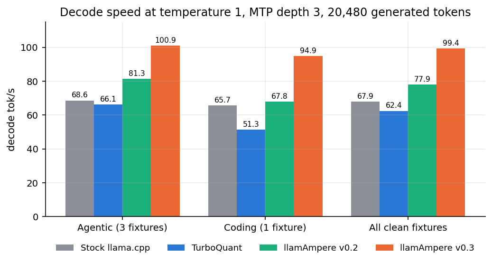
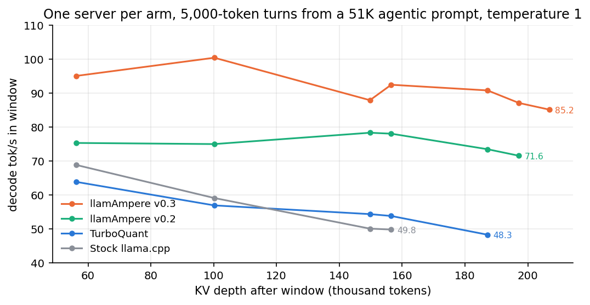
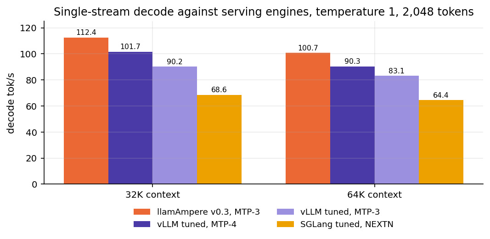

# v0.3: exact p/q draft verification, a fused attention stack, and an honest ladder against stock

*The sequel to [v0.2](../llamampere-v0.2/ARTICLE.md). Same card, same
model file, same sampler. Everything below was measured on one RTX 3090 Ti (24 GB, power-capped at
350 W) with Qwen3.8-27B ATX-IQ4_XS-M, and every number links back to a logged run.*

## The short version

The change we set out to make in v0.3 was to how drafted tokens are **verified**. The change that
actually produced the speed was the attention stack underneath it. Both are below, in that order,
along with a second look at what our fork is worth against a stock build — and the decomposition
that corrects our own headline, because at a fixed draft depth every run reports enough to split a
speedup into "accepted more tokens" and "ran each pass faster", and this release is 68-88% the
second one.

1. **Exact p/q (rejection-sampling) draft verification, on by default.** The MTP drafter proposes a
   token; the old rule accepted it only if the target's argmax was the same token. The new rule
   accepts with probability `min(1, p/q)` — so agreement on the *shape* of the distribution counts,
   not only on the argmax. Weighted **G = +7.45%** over three seeds, against a timing-repeat SD of
   0.26%. Tokens per round rise on every fixture: coding 3.13 → 3.40, agentic 3.23 → 3.49, rag
   2.50 → 2.73. It is exact: the acceptance histogram matches the old rule by chi-square
   (p = 1.00 / 0.98 / 0.99) and greedy output is hash-identical (`70d92f3ff9eac692`).
2. **A fused MMA attention stack that now covers both KV caches in the speculative loop** — the
   target's q8_0-K/turbo3-V verify path (P5b, P5c) and the drafter's own q8_0/q8_0 cache (P6).
   Per-round cost falls 4.0% / 0.2% / 8.7% (coding / agentic / rag) from P5b, a further
   1.8% / 2.2% / 3.7% from P5c, and 0.5–0.8% from P6, which also hands back 170–260 MiB.
3. **Two recurrent-state correctness fixes that ship with no flag** (RB1, RB1b). These buy no
   speed. They fix rollback writing over history it should not have touched, which is the kind of
   bug that shows up as an unreproducible generation months later.
4. **A ladder against two clean floors, instead of one number against one unnamed "stock".**
   Upstream llama.cpp master and TurboQuant's tip are measured separately, each built clean and each
   launched with only the flags its own tree understands. Across the four cells that survive the
   loop screen, the shipped build runs **1.46× upstream master** (range 1.45–1.49), **1.61×
   TurboQuant's tip** (1.51–1.85), and **1.28× our own v0.2** (1.24–1.40).

Decode tok/s at temperature 1 with the production sampler, averaged per workload. Arm names are the
builds, not the branch labels: **Stock llama.cpp** is upstream master `8ea290247`, **TurboQuant** is
`1208c5956` built clean, and the two llamAmpere columns are our own releases.

| workload | Stock llama.cpp | TurboQuant | llamAmpere v0.2 | **llamAmpere v0.3** | vs stock | vs TurboQuant | vs our v0.2 |
|---|---:|---:|---:|---:|---:|---:|---:|
| Agentic (3 fixtures) | 68.6 | 66.1 | 81.3 | 100.9 | 1.47x | 1.53x | 1.24x |
| Coding (1 fixture) | 65.7 | 51.3 | 67.8 | 94.9 | 1.45x | 1.85x | 1.40x |
| **All clean fixtures** | 67.9 | 62.4 | 77.9 | **99.4** | **1.46x** | **1.61x** | **1.28x** |



Ratios are the mean of per-cell ratios, not the ratio of the column means; the two differ in the
third decimal and the per-cell form is the one that survives a fixture being dropped. The retrieval
(rag) workload is absent on purpose: every arm but v0.3 degenerates into repetition before the
generation ends, and degenerate text is trivially draftable, so those cells measure looping rather
than speed. The long version of that argument, including the two coding cells excluded for the same
reason, is in "What it adds up to" below — it is the most important caveat in this post.

The rest of this post walks the ladder in build order, then gives the long-generation curves and
the ladder against stock.

## Where v0.2 left us

v0.2 ended on the 64K draft-vocabulary shortlist and a set of runtime fixes. The first thing this
round produced was, again, a census rather than a kernel: **R0**, an nsys gap census on the
production stack, asking whether any host-side lever was left worth pulling.

The answer was no, and the numbers are worth printing because they bound what a host-side fix
could ever be worth here. Production coding 100K decode, 81 rounds at 44.8 ms each, GPU busy 88.2%:

| idle class, per decode round | ms |
|---|---:|
| kernel launch | 1.94 |
| host work | 1.71 |
| sync wait | 0.56 |
| graph build | 0.37 |
| tiny transfers | 0.26 |
| device→host | 0.18 |
| host→device | 0.14 |
| other | 0.14 |
| **total idle** | **5.30** |

That is 11.8% of every round host-dependent, and no single class clears the 1 ms/round bar the
plan had pre-registered as the threshold for chasing it. Two premises died with it: CUDA graphs
are *not* churning (the 4,102-node main graph is captured once and reused 81 times, the 63-node
drafter graph 256 times — the big gaps are the warm-up captures), and context checkpoints cost
nothing on the host side (1.83 ms host work without them against 1.71 ms with).

One residual was recorded rather than queued: roughly **378 non-graph kernel launches per round**,
the drafter/verify glue that sits outside the captured graphs, accounting for the launch + host
work 3.6 ms/round (8% of the round). If anyone picks up host-side work again, that is the item.

## Step 1: the fused MMA attention path becomes the default route (P5b, P5c)

v0.1 built a fused MMA attention kernel for compressed KV and left it behind
`GGML_Q8_TURBO3_MMA_FUSED=1`. P5b makes q8_0-K / turbo3-V verify attention take that kernel by
default, and P5c removes the conversion step that had been sitting in front of it: the tile loaders
now read q8_0 K and turbo3 V in their stored form instead of materializing an intermediate.

SP2 cannot attribute this step, and it is worth saying why rather than implying otherwise: its
four arms bracket whole builds, so the V02→CUR column is the entire v0.2→v0.3 delta and not a
per-commit split. The per-step numbers here and below come from each step's own gate. For P5b,
ms/round −4.0% coding, −0.2% agentic, −8.7% rag. For P5c, a further −1.8% / −2.2% / −3.7%, with
the kernel itself going 456 µs → 344 µs.

## Step 2: the drafter gets the same kernel (P6)

The drafter runs its own KV cache, and it had been running q8_0-K/q8_0-V through the generic path
while the target ran the fused one. P6 extends the fused MMA instantiation to q8_0-K/q8_0-V, which
is what makes `--spec-draft-type-v q8_0` the shipped drafter-cache setting rather than turbo3.

Kernel 321 µs against f16's 441; ms/round −0.5 to −0.8%; output byte-identical to the f16 cache;
170–260 MiB returned. The memory matters more than the speed here — it is part of what buys back
the headroom the long-context work needs.

## Step 3: verify widths 6–8 (DF3) — built, measured, and left off by default

`GGML_Q8_TURBO3_MMA_MAX_Q=8` routes verify widths 6 through 8 onto the fused (8,8) instance
instead of letting them fall back to the generic mma_f16 dequant path, and it fixes a real kernel
deficit: 412 µs against 1,462 µs.

It does not ship on, and it is in none of the numbers in this post. The default is 5
(`ggml/src/ggml-cuda/fattn.cu`), which covers the verify widths MTP depth 3 and 4 actually
produce. Widths 6–8 come from DFlash2's block_size-8 verify, and DFlash2 is carried for merge
hygiene rather than used (Step 4). At the shipped draft depth there is nothing for DF3 to route,
and no benchmark in this post sets the flag.

It is written up because the kernel work is real and because the honest form of "we fixed
DFlash2's only kernel deficit" is that fixing it still left DFlash2 behind — 15% at greedy and
13% at temperature 1.0.

## Step 4: the DFlash2 port (DF1)

Upstream llama.cpp PR #27342 landed DFlash2 support. We carry it rather than diverge. Nothing in
this release's headline depends on it; it is here so the fork does not accumulate a merge debt.

## Step 5: exact p/q draft verification (the release's largest single win)

This is the one to read.

A speculative decoder drafts a token `d` from the draft distribution `q`, then asks the target
distribution `p` whether to keep it. The rule we had been using — and the rule most
implementations use — is **identity match**: accept `d` if `argmax p == d`. It is simple, and it
is needlessly strict. The target can put 0.4 of its mass on the drafted token and still reject it
because some other token holds 0.41.

The correct rule is the one from the original speculative-decoding papers: accept with probability
`min(1, p(d)/q(d))`, and on rejection sample from the residual `max(0, p - q)` renormalized. That
rule is **exactly distribution-preserving** — the output is drawn from `p`, token for token, which
is why the chi-square against the old rule comes back at p = 1.00 / 0.98 / 0.99 and why greedy
output is hash-identical.

Measured under the ship rule (weighted `G = 0.4·coding + 0.4·agentic + 0.2·rag`, ship if
`mean G > 2·SD_G`):

| fixture | mean gain |
|---|---:|
| coding | +7.5% |
| agentic | +8.0% |
| rag | +6.3% |
| **weighted G** | **+7.45%** |

against `2·SD_G` of 0.51% (timing-repeat SD 0.26%). Per seed: +10.99 / +13.85 / −2.49 on
6100 / 6101 / 6102.

The mechanism is visible in tokens per round, which is the quantity that actually moved:

| fixture | tokens/round before | after |
|---|---:|---:|
| coding | 3.13 | 3.40 |
| agentic | 3.23 | 3.49 |
| rag | 2.50 | 2.73 |

It costs +0.3 to +1.7 ms per round, because `p_min 0` means the drafter always produces its full
three tokens instead of bailing early. That trade is strongly positive at depth 3.

**A process note that belongs in the record.** The first verdict on this experiment, at 17:10 on
2026-09-10, *declined to ship it*. That verdict was wrong: it had added an all-seeds-positive
condition that is not part of the ship rule, and seed 6102's −2.49% tripped it. The rule as stated
compares the mean of G to twice its SD and says nothing about individual seeds. The verdict was
recomputed on the same data the same evening and the feature shipped.

## Step 6: proving it was the rule, not the text (PQ2)

PQ1 left one question open, and it is the question any careful reader asks. The two arms diverge
after the first rejection decision — they are decoding *different text* from that point on. So is
the +7.45% the verify rule, or is it that one arm happened onto an easier continuation?

PQ2 answers it without a new A/B, because production already records both quantities on the same
rows of the same run. Pooled over 3 fixtures × 3 seeds, 4,874 verified positions:

| quantity | value |
|---|---:|
| E[acceptance], identity-match rule | 0.7939 |
| E[acceptance], p/q rule | 0.8475 |
| difference | +0.0537 (+6.76% relative) |
| positions accepted by the residual test alone | 250 (5.13%) |

Both numbers come off the *same* rows, which holds the text path exactly constant. Projected to
throughput at depth 3 under an iid approximation: 2.9245 → 3.1747 tokens/round, **+8.55%** — the
right magnitude against a shipped +7.45%, and slightly above it, which is what you expect when
positions are not iid and per-round cost is not constant.

Two methodological traps came out of this and are worth more than the result:

- **Never stratify this contrast on `p(d_i)`.** The inequality `Σ q(d)p(d) ≤ Σ min(p(d),q(d))`
  holds *in expectation over `d ~ q`*. Bucketing on `p(d_i)` conditions on the drawn token and
  prints spurious negative gains (−0.0497 in the `[0.95, 0.99)` bucket). The analysis tool now
  emits only functions of `p` alone and refuses to read pre-covariate position files.
- **Removing that bias does not make each bucket provably non-negative**, and an earlier revision
  of the write-up wrongly said it did. The inequality binds the expectation; `E[id]` is a
  one-draw-per-row Monte-Carlo estimate. Three buckets still print negative; the only one large
  enough to chase resolves to a clean self-check (6,757 of its rows have a single draft candidate
  and give exactly +0.000000, because `d` is forced and the two estimators are algebraically
  identical) plus 301 point-mass-`p` rows where the contrast is pure calibration. Net effect
  0.0018 absolute in a post-hoc 3.8% subset, in the direction that makes the headline
  **conservative**.

## Step 7: the MMVQ launch table (QC2, QC4)

Small, real, and reported as such. The MMVQ launch geometry had one table entry for all widths;
`rows_per_cuda_block` is now 8 at the SM86 verify widths (QC4), and Q5_0 gets the SM86
cross-column reuse the other formats already had (QC2). The launch table itself became tunable in
the same commit, which is what made QC5 below cheap to test.

Sizes, again from their own gates rather than from SP2: QC4's `nw4_rb8` is +8.40% on the kernel,
which is +4.88% at model level — above what the A/B/B/A can resolve, which is why it was gated on
its own, and it is bit-exact. QC2's Q5_0 analogue landed at +3.19% on the kernel and about
+0.25% tok/s at model level, which is below the ladder's noise floor. Both are default-on.

## Step 8: two rollback fixes that ship with no flag (RB1, RB1b)

Neither of these buys a token per second. Both ship unconditionally.

**RB1.** The causal-conv snapshot emit wrote `K = n_rs_seq + 1` slots regardless of how many the
ubatch could actually produce, so on a 1-token ubatch it overwrote history. Now it writes
`min(n_seq_tokens, K)`. The GPU rollback test passes on the production cache config — the
dirty-context restore mismatch R0 had found (3.71 against 6.80 at the first replayed position) is
gone — greedy hash is identical, and ABBA at seed 6100 measures G = +0.03% against 2·SD 0.25%,
i.e. free.

**RB1b.** Partial rollback had no valid-snapshot bound: the reader would walk back past snapshots
that were never written. It is now bounded by what was actually written, with gate tests for the
reader.

One known gap is left open and is *not* fixed by either: `LLAMA_GDN_REPLAY=1` still fails
(pre-existing, `delta-net-base.cpp:639-760`). It is filed, not hidden.

## The ladder, and one mis-built arm that nearly went into it

"Faster than stock" is only worth printing if "stock" is a build someone else can check out. v0.3
measures two floors rather than one, because they answer different questions:

- **S-up**: ggml-org llama.cpp master `8ea2902`, `-ctk q8_0 -ctv q8_0`, no fused-MMA env flag, no
  vocab map. The outside floor — what you get without any of this. Upstream supports
  `--spec-type draft-mtp` natively, so MTP depth 3 is available and used; this is a fair
  speculative-decoding baseline, not a no-speculation strawman.
- **S-tq**: TurboQuant `1208c5956` built clean, `-ctk q8_0 -ctv turbo3` (turbo3 is theirs), no
  vocab map, no `GGML_*` override. The floor this fork actually started from.

### The arm that was wrong, and how it was caught

The first collection of this ladder had an invalid S-tq. The binary was built from `fdfea8123` — a
**merge** of TurboQuant's tip into our own `perf/qwen38-sm86-decode-product` tip (`3612acca6`). The
two sides are disjoint below merge-base `f97400563`, so the "baseline" carried fifteen of our own
commits: the SM86 MMA attention tile loaders, the cp.async KV staging, the Gated DeltaNet
four-column ILP path, decode graph reuse, and MTP compute-buffer sharing. It was additionally
launched with `GGML_Q8_TURBO3_MMA_FUSED=1`, a symbol that exists in **zero files** at TurboQuant's
tip. It was our September 2 stack wearing a label with someone else's name on it.

Rebuilding TurboQuant clean and re-running the identical protocol measures the error directly:

| cell | merge build, labelled "stock" | TurboQuant `1208c5956`, clean | inflation | output identical |
|---|---:|---:|---:|:--:|
| agentic/shard1 | 82.13 | 68.62 | 1.197× | yes |
| agentic/shard2 | 79.25 | 65.83 | 1.204× | yes |
| agentic/shard3 | 78.45 | 63.95 | 1.227× | yes |
| coding/matplotlib-23563 | 65.69 | 50.22 | 1.308× | yes |
| coding/pytest-7490 | 82.09 | 64.05 | 1.282× | yes |
| coding/sympy-20322 | 88.05 | 68.60 | 1.284× | yes |
| **mean** | | | **1.250×** | |

A baseline that flatters you by 25% is worth knowing the shape of, which is why it is printed rather
than quietly dropped. Those rows are excluded from the grid below — not averaged in, not corrected
by a factor. The last column is what makes the diagnosis airtight rather than an argument about
commit graphs: the two binaries produce **byte-identical generations** — same SHA-256, same file
length, 70,186 bytes on agentic/shard1 and 72,735 on sympy — so they were doing identical work,
token for token. One of them was simply 25% faster, because it was partly us.

**This did not reach anything published.** The v0.2 release's stock arm was a different build
entirely: a separate `-stock` tree at `1208c5956`, launched with `env={}` and no vocab map, which is
what produced its 55.98 tok/s reference. The mis-built binary was used in v0.2's *checkpoint* arm,
where it was correctly labelled as ours. The contamination was confined to this ladder's first
collection and is corrected here before any number left it.

### A useful side effect: one comparison in this release has no divergence confound at all

The hash check above turned up something worth keeping. **S-tq and V02 emit byte-identical output**
— and so did the merge build. Three different binaries, one token stream, on every fixture tested.

That means everything in llamAmpere through v0.2 is output-preserving on this configuration: the
fused MMA attention kernel, the tile loaders, the graph reuse and the buffer sharing change *when*
the tokens arrive, not *which* tokens arrive. (v0.2's own table said as much in a quieter way —
draft acceptance was 0.660 with the fused kernel off and 0.660 with it on.)

It matters because temperature-1.0 A/B testing normally carries a real hazard, and this release
contains a worked example of it (P5f, below): a change that perturbs logits at the ulp level can
flip one near-tie sampled token, after which the two arms are decoding different text and the
comparison quietly stops being a comparison. The V02-against-S-tq contrast cannot suffer from that,
because the output is identical to the byte. Whatever speed difference it shows is pure throughput.

The CUR arm is where output legitimately changes — the 64K vocab map and p/q verification both alter
acceptance by design (0.806 against 0.757 on agentic/shard1) — so that contrast is held to the
distributional-equivalence evidence in Step 5 instead.

## What it adds up to

Four arms, one model (`Qwen3.8-27B-ATX-4-XS`), one protocol. **S-up** is upstream llama.cpp
master `8ea290247`. **S-tq** is TurboQuant's tip `1208c5956`, built clean. **v0.2** is our
`44233f009`. **v0.3** is `36a6bca81`. Decode tok/s, mean of three runs unless marked.

**Two of the nine cells are not in this table, and the reason is the most useful thing in this
section.** Each run is screened for degenerate repetition. On `coding/pytest-7490` the S-tq and
v0.2 arms enter a repeat loop at token **459** of 20,480 — 97.8% of that generation is degenerate
text — while S-up and v0.3 never loop. On `coding/sympy-20322` v0.2 loops at 3,625 and v0.3 at
12,838. Loop onset is deterministic per arm at fixed seed: 459 on every one of six runs, 3,625 on
every one of six.

Degenerate text is trivially predictable, so a drafter accepts nearly all of it and the looping arm
posts an *inflated* tok/s. The contamination is therefore not symmetric — it lands on whichever arm
loops earliest, which in both cells is v0.2. This cannot be repaired arithmetically: acceptance is
reported once per request, so tok/pass and passes/s cannot be attributed to a clean prefix at all,
and rescaling only tok/s would produce a table whose columns stop multiplying together. The rule is
to re-run pinned to the shortest clean prefix, with a floor of 4,096 tokens below which the re-run
would measure warm-up rather than steady state. Both cells fall under that floor. They are excluded
with this note, which is a real finding about the fixtures rather than a number to average.

| fixture | S-up | S-tq | v0.2 | v0.3 | v0.3 / S-up | v0.3 / S-tq | v0.3 / v0.2 |
|---|---:|---:|---:|---:|---:|---:|---:|
| agentic / shard1 | 70.35 | 68.62 | 83.99 | 104.52 | 1.486 | 1.523 | 1.244 |
| agentic / shard2 | 67.43 | 65.83 | 79.90 | 99.29 | 1.472 | 1.508 | 1.243 |
| agentic / shard3 | 68.15 | 63.95 | 80.00 | 98.99 | 1.452 | 1.548 | 1.237 |
| coding / matplotlib-23563 | 65.66 | 51.27 ‡ | 67.75 | 94.90 | 1.445 | 1.851 | 1.401 |
| **mean** | | | | | **1.464** | **1.608** | **1.281** |

‡ the only arm in the table whose three runs are not from one collection epoch: two from the
v2 epoch and one from v4, after a third v2 run was gated out on host CPU (cc1plus and cudafe++
at 200%). Splicing across epochs is the weaker of the two admissible choices — a consistent
estimator per arm is worth more than one extra sample — so it is used only where no single
epoch reaches three. The three agree to SD 0.39 tok/s, and all three emit the identical output
hash. Preferring the two same-epoch runs alone would read 51.49 and move v0.3/S-tq from 1.851
to 1.843, in our favour; the spliced value is the one reported.

**What is excluded, stated plainly.** All three `rag` shards were collected at 20,480, and all
three are loop-contaminated: every arm loops except v0.3, which stays coherent for the full
generation on shard1 (5/5 runs) and shard3 (3/3). Loop onset is deterministic to a single value per
arm per fixture across every repetition — 17,563 / 17,285 / 17,285 on shard1, 16,009 / 14,486 /
14,486 / 14,118 on shard2, 19,138 / 17,024 / 17,024 on shard3, reading S-up / S-tq / v0.2 / v0.3.

The direction of the contamination is not the same on every shard, which is the reason none of it
can be waved through. On shard1 and shard3 v0.3 is the only arm that stays coherent, so leaving those
rows at 20,480 would inflate the arms we measure ourselves against and *understate* our margin. On
shard2 it reverses: v0.3 loops **earliest** of the four, at 14,118 against 14,486 for TurboQuant and
v0.2 and 16,009 for upstream, so that row at full length inflates *us*. A correction that only ran one
way could be justified as conservative; one that runs both ways cannot be reasoned about at all. A
re-run pinned to each shard's shortest onset was considered and not done, by decision: this post
reports the four clean cells above and leaves the rag row out rather than filling it with degenerate
text. The consequence is stated rather than hidden — the cross-arm table covers agentic and coding
only, and the coding row rests on one fixture. The ship decision for p/q itself does not depend on
this table; it was made on its own three-seed A/B/B/A in Step 1, which includes rag.

**The ratio is not the interesting part. The decomposition is.** Every run reports `predicted_n`
and `draft_n_accepted`, and at a fixed draft depth those give an exact split with nothing
estimated: `passes = predicted_n − draft_n_accepted`, so `tok/pass = predicted_n / passes` and
`passes/s = passes / predicted_ms`. Splitting v0.3-over-v0.2 on the clean cells:

| fixture | passes/s ratio (kernel) | tok/pass ratio (acceptance) |
|---|---:|---:|
| agentic / shard1 | 1.191 | 1.045 |
| agentic / shard2 | 1.204 | 1.032 |
| agentic / shard3 | 1.171 | 1.057 |
| coding / matplotlib-23563 | 1.172 | 1.196 |

On the three agentic cells — the only workload with three clean fixtures — the split is **1.189
kernel against 1.045 acceptance**. Roughly 19 points of the gain are kernel and roughly 4 are
acceptance, which is not the story we expected to tell, given that exact p/q verification is the
release's headline change and p/q is an acceptance mechanism.

The explanation is ordering. Step 5's +7.45% G was measured against v0.2's *rule* running on
v0.2's kernels. By the time p/q ships on top of P5b, P5c and P6 the per-pass cost has already
fallen, and at that point a faster pass is worth more than a fuller one.

The same split against the two stock arms says the release is a kernel release outright:

| v0.3 over | tok/s | = acceptance | × kernel | kernel's share of the log gain |
|---|---:|---:|---:|---:|
| v0.2 (`44233f009`) | 1.281 | 1.082 | 1.184 | 68% |
| TurboQuant (`1208c5956`) | 1.608 | 1.082 | 1.483 | 83% |
| upstream (`8ea290247`) | 1.464 | 1.048 | 1.399 | 88% |

Each column is the mean of the four clean cells' per-cell ratios, so `acceptance × kernel`
reproduces the `tok/s` column only to within a rounding-scale residual (1.282 vs 1.281, 1.605 vs
1.608, 1.466 vs 1.464) — the mean of a product is not the product of the means. Within any single
cell the identity is exact by construction, and `analyze_sp2.py` asserts it there. "Share of the
log gain" is `ln(kernel) / ln(tok/s)`; it is a decomposition of a ratio, not a percentage of time
saved, and the two are not interchangeable.

Against upstream the acceptance factor is 1.048 and against TurboQuant 1.082, while the kernel
factor is 1.399 and 1.483. Whatever else this release did, it did not mainly make the drafter
better at guessing.

**Matplotlib is a fourth arm's worth of evidence about turbo3, not about the vocab map.** Its
tok/pass ratio of 1.196 is by far the largest acceptance gain in the grid, and the tempting
reading — that v0.3's vocab map repairs a bad v0.2 cell — does not survive the acceptance column.
S-tq and v0.2 post *identical* acceptance in every cell of the grid (0.603 / 0.603 here), which is
what the byte-identical output hashes already said: below the throughput layer they are the same
build. On this fixture both turbo3-V arms sit at 0.603 while **upstream, on a q8_0 V-cache and
with no vocab map of any kind, reaches 0.805**. So the vocab map cannot be what recovers it. What
the numbers support is narrower and more interesting: on this one fixture a turbo3 V-cache costs
about a quarter of the drafter's acceptance, and exact p/q verification recovers nearly all of it
(0.786). It is not a systematic turbo3 penalty either — on the three agentic fixtures and on rag
the turbo3 arms accept *more* than upstream, not less.

Writing the grid up as "acceptance improved" would be false, and it is the claim the headline
invites. On the clean agentic cells the kernel work is carrying this release.

## Speed over long generations

The table above is a 20,480-token generation. It says nothing about what happens at 150K, and the
thing we most want to know about a speculative decoder is whether its advantage survives a long
context or quietly evaporates into it.

Phase 2 measures that. One server per arm, never restarted, `cache_prompt` on, starting from the
51,223-token agentic fixture and then taking sequential 5,000-token turns, each turn injecting four
fresh SWE-bench cases so the context keeps growing with new material as well as with the model's own
output. Seed is 6100 + window. Every window is reported on its own, because `draft_n_accepted` is
reported once per request and a single long completion would yield exactly one acceptance number.

**What ran is not quite what was designed, and the difference matters for how to read it.** The
design called for 40 turns and 200,000 generated tokens. The context fills first: at
`-c 208,896` — the context v0.3 and v0.2 both run at under the 23 GB cap — the run stops
when the next turn would not fit, which is after **17 windows, about 85,000 generated tokens, with
the KV cache at 206,851 tokens**. So the x-axis below is KV depth after each window, not tokens
generated: that is the quantity the attention kernel actually pays for, and it is identical across
arms to within five tokens at every window, so arms line up window for window.

Three curves per arm, not one, because the two factors decay for different reasons:

- **passes/s** per window — kernel decay, the cost of attending over a KV cache that keeps growing.
- **tok/pass** per window — acceptance decay, the drafter drifting as the context it conditions on
  gets longer.
- **tok/s** per window — their product, the number a user actually feels.

Decode tok/s by window, temperature 1.0, same fixture, same injection schedule:

| KV depth after window | v0.3 | v0.2 | TurboQuant | upstream |
|---:|---:|---:|---:|---:|
| 56,222 (window 0) | 95.09 | 75.34 | 63.87 | 68.86 |
| 100,201 (window 4) | 100.45 | 75.01 | 56.94 | 59.11 |
| 149,743 (window 10) | 87.94 | 78.35 | 54.37 | 50.09 |
| 156,515 (window 11) | 92.49 | 78.07 † | 53.82 | 49.83 (last window) |
| 187,185 (window 14) | 90.82 † | 73.49 | 48.30 (last window) | — |
| 197,174 (window 15) | 87.12 | 71.57 (last logged) | — | — |
| 206,851 (window 16) | 85.16 | — | — | — |



† host-noisy window (median foreign CPU above 70% when the window began): flagged, not dropped,
for the same reason the Phase 1 grid does not drop slow rows. v0.3 has five such windows out of 17
(3, 5, 9, 13, 14), which is why its tok/s line is visibly jagged while its passes/s line is not.

**v0.3 holds its speed.** First five windows against last five, arm-internal: v0.3 goes 98.0 → 88.6
tok/s (**−9.6%**), v0.2 −8.1%, and TurboQuant −21.6%. Split into its factors, v0.3's passes/s falls
18.9% (30.30 → 22.96 end to end) while its tok/pass *rises* 11.4% (3.14 → 3.71). v0.2 shows the
same shape: passes/s −17.2%, tok/pass +10.9%. **The decay is the kernel, not the drafter.** Nothing
in this run says the MTP head gets worse at guessing as context grows; on this fixture it gets
better, and it partly pays for the attention cost.

**The gap to our own v0.2 does not close with depth.** The passes/s ratio v0.3/v0.2 is 1.168 at
window 0 and 1.170 at window 15, and never leaves 1.166–1.183 in between. The tok/s ratio over the
first five clean windows is 1.226 and over the last five 1.224. Whatever P5b, P5c and P6 bought at
20K, they still buy at 197K.

**Against TurboQuant the gap widens, and one of those comparisons has no confound at all.** Recall
from the ladder that clean TurboQuant and v0.2 emit byte-identical output. They still do here: their
tok/pass is identical in every one of the 15 windows both arms ran, so the ratio of their passes/s
is pure throughput. It is **1.180 at 56K and 1.522 at 187K**, rising at every single window. That is
v0.2's attention stack pulling away from the one it started from as the cache grows — the first
long-context measurement in this series that the divergence confound cannot touch. v0.3 over
TurboQuant on passes/s goes 1.377 → 1.781 over the same windows; that one does carry the confound on
tok/pass, but not on passes/s, which is a function of the kernel and the KV length and not of which
tokens were drawn.

**The stock arms also stop earlier, because their KV costs more memory.** v0.3 and v0.2 reach
208,896 tokens of context under the cap. Upstream on a q8_0/q8_0 cache ran at 159,744 and TurboQuant
at 188,416, with peaks of 23,335 and 23,310 MiB against v0.3's 22,759. Those two ceilings were set
by estimate to stay under the cap, not probed to the last tile, so read them as "at least this much
less", not as exact limits.

Handling, stated rather than buried:

- **Same model in every arm quoted above.** A first Phase 2 pass ran the two stock arms on
  Unsloth's UD-Q3_K_XL instead of ATX-4-XS; those curves exist (upstream −22.7%, TurboQuant −28.9%
  tok/s over the run) but are a different file, so they are not in the table and not in any ratio.
  The ATX-4-XS stock arms were re-run the same afternoon, from the same fixture, in separate server
  sessions.
- **Loops are excluded, not flagged.** The upstream arm's first attempt at seed 6100 looped in
  windows 1–3 and hit the three-consecutive-loops abort; only its window 0 (69.27 tok/s) was clean.
  It was re-run at base seed 6101, where windows 2 and 3 still looped and are excluded from every
  number above. That arm is therefore on a different seed schedule from the other three, and its
  tok/pass falls with depth (−4.7%) where every other arm's rises, which is plausibly the text and
  not the drafter. No v0.3, v0.2 or TurboQuant window looped.
- **v0.2's log has no end-of-run line.** It has 16 windows, reaching 197,177, and by the arm's own
  stopping rule a 17th should have run. Its last window is reported as the last one logged, not as the
  ceiling.
- **The cross-arm tok/pass gap is still confounded**, exactly as it was in the ladder: v0.3 decodes
  different text from v0.2 after the first window, so "v0.3's drafter is N% better at 150K" is not a
  claim this data supports. The arm-internal shapes and the passes/s ratios are.

## Against vLLM and SGLang

The ladder compares us to llama.cpp builds. The question readers actually ask is whether a
serving engine would do better on the same card, so Phase 3 put the two obvious ones on it, each with
its own MTP speculative decoding and each tuned rather than run at defaults.

Decode tok/s at temperature 1.0, single stream, 2,048 generated tokens, mean of three, all under the
23,552 MiB cap at peak:

| context | llamAmpere v0.3, MTP-3 | vLLM tuned, MTP-4 | vLLM tuned, MTP-3 | SGLang tuned, NEXTN | v0.3 over best other |
|---|---:|---:|---:|---:|---:|
| 32K | **112.4** (18,812 MiB) | 101.7 (23,295) | 90.2 (23,187) | 68.6 (23,028) | 1.10× |
| 64K | **100.7** (19,847 MiB) | 90.3 (23,356) | 83.1 (23,365) | 64.4 (23,348) | 1.11× |



Draft acceptance for vLLM MTP-4 was 0.808 at 32K and 0.759 at 64K (sample SD of its 64K tok/s:
3.8). MTP-4 was vLLM's best configuration; MTP-3 is printed because it is the like-for-like depth.
Past 64K neither engine fits under the cap in any configuration we found; v0.3 at 64K peaks
3,705 MiB below it.

What that comparison is and is not:

- **They run a different checkpoint.** Neither engine loads our GGUF, so both served
  `Qwen3.8-27B-W4A16-AWQ`, text-only. It is not smaller than ours: vLLM reports 17.38 GiB for model
  loading, against 14.52 GiB for ATX-4-XS, because the linear-attention layers, output head, embeddings
  and MTP head all stay in BF16 — 8.26 of its 17.35 GiB are not 4-bit at all.
- **Their KV is less compressed than ours.** fp8 K and V for both, which is what fits; ours is
  q8_0 K and turbo3 V. That asymmetry favours us on memory and is part of why they run out of card
  at 64K.
- **Single stream is their weakest regime.** Both are built for batched serving, and nothing here
  says anything about throughput at concurrency above one. This is the single-user local case, which
  is the case this fork is for.
- **Tuning is disclosed in the SP3 logs.** vLLM 0.29.0 with FlashInfer, piecewise CUDA graphs (full
  graphs are not supported with speculation on that backend), `--max-num-seqs 1`, async scheduling,
  an explicit KV byte budget, and a patch to share the MTP head with the target; SGLang 0.5.9 with
  the radix cache off, NEXTN at 3 steps / 4 draft tokens, and the same MTP-sharing and text-only
  patches. Several configurations went over the cap at peak and are not in the table.
- **Counted by tokens, not chunks.** A streaming engine that emits several accepted tokens per chunk
  reads 20–25 tok/s if you count chunks. Every number above is from the server's own
  `completion_tokens`; for llama.cpp the two counts differ by at most 1.3% in any run.

## What did not work

- **H1, the all-Q6_K → Q8_0 requant** (output head plus 24 `attn_k`/`attn_v` tensors). Rejected on
  speed: G = −4.98% (coding 95.48 → 88.79 tok/s, agentic 107.80 → 104.37, rag 65.54 → 62.59)
  against 2·SD_G of 0.69%. Acceptance fell in every fixture (0.872 → 0.785, 0.935 → 0.894,
  0.558 → 0.508). The *quality* gate passed cleanly — max KLD 0.030 against the production file on
  wikitext-2, same-top-p 99.1%, PPL ratio 0.9993 — so this is a case where the model got no worse
  and the product got slower. An attribution run isolated the cause: the Q8_0 file itself (+33%
  bytes per verify pass on a 995 MiB output head, and a lower-acceptance distribution), not the
  drafter cache change that had been confounded with it in the first run.
- **H2, trying to recover H1's acceptance.** Seven arms on one binary. H1 stayed rejected, and the
  exercise confirmed that the current-best speculative configuration is the one already shipping.
- **P5f, 2-deep raw K/V staging in the turbo attention kernel.** Mean G = −1.54% against
  2·SD_G = 0.43%. But the headline must not be quoted as the reason, because **coding is
  confounded**: the two arms produced different output on coding (`a6685cd2…` against `8968ba2f…`)
  while producing identical output on agentic and rag. Depth 2 reorders K/V arrival at the
  accumulator and perturbs logits at the ulp level — invisible to greedy argmax, but at temperature
  1.0 it can flip one near-tie sampled token, after which the two arms are decoding different
  sequences. The real reason to reject is that on the two fixtures where the comparison is valid,
  depth 2 does *nothing*: +0.17% and −0.10%, mean +0.04% against a 0.43% threshold. The mechanism
  is understood: the (4,8) instantiation carries ≥93% of decode and sits at the 255-register
  ceiling, and double-buffering only pays if the second slot's load can overlap compute. With no
  register headroom the prefetch issues and then waits. It got its best case — occupancy was
  unchanged at 2 blocks/SM — and still measured zero.
- **R6, register-capping the IQ4_XS matvec.** ncu at width 4: 102 registers cap residency at 4
  blocks/SM (33% occupancy, 27–29% achieved), no dominant stall, issue slots 51% busy, DRAM 54–67%
  of peak. Capping to 64 registers (8 blocks, 67%) and to 80 (6 blocks, 50%) is exact by
  construction and spill-free per ptxas — and both lose 27–30% at width 4 and are flat at widths 3
  and 5. Occupancy is not the limiter; the kernel is bound by the per-warp load-to-dp4a chain.
- **`GGML_CUDA_QC4_NW1` as a default.** Shipped as a runtime flag, **off**. The stated preference
  was default-on if it was genuinely fast, and at the verify width production actually runs, it is
  not.
- **A4, routing width-2 verification to the fused instance.** Parked, not rejected: it is worth
  about 2.4% at 100K, but it is **not** output-identical (hash and trajectory both change), so it
  needs the full quality protocol before it can be considered. Filed at that state rather than
  shipped on a speed number.
- **Bit-trick arithmetic, audited for anything left and finding nothing.** Worth writing down
  because it is the optimisation people ask about first. *Fast inverse square root has no place on
  this hardware*: `rsqrtf` lowers to `MUFU.RSQ`, one instruction on the SFU pipe, and every norm
  already uses it (`norm.cu:34,70,141,273`). The Quake trick emulates in software an instruction
  the GPU has in silicon. *Division by a runtime constant* is already Granlund–Montgomery
  throughout — upstream's `init_fastdiv_values`/`fastdiv`/`fastmodulo` (`common.cuh:909-945`),
  which our `gated_delta_net.cu:43-44` uses for head/sequence indexing. What survives a sweep of
  the hot decode kernels is compile-time constant (`QK_TURBO3` is 128; the compiler strength-reduces
  it) or three loop-invariant divisions at flash-attn kernel entry (`fattn-vec.cuh:143,147,148`),
  amortised over a 147K-token KV loop. *Where the genre does pay, it was already taken*: int8→fp16
  with no `I2F` at all, by splicing the byte under an fp16 exponent of `0x64` and subtracting
  `0x6480` (`fattn-mma-f16.cuh:586-632`); eight 3-bit turbo3 indices spread into nibbles with
  `0x0F0F0F0F`/`0x33333333` masks and resolved four-at-a-time by `PRMT` (`:747-760`); the sign
  applied by ORing bit 31 rather than multiplying (`:690-696`); and IQ4's 16-entry table done as
  two `__byte_perm`s split on the high bit, since `PRMT` indexes only 3 (`vecdotq.cuh:1365`, which
  is upstream's). The two sites still written in the old per-value style are both off the shipping
  path — the turbo3 loader at `fattn-mma-f16.cuh:634` needs a non-q8_0 K, and the `fattn-vec.cuh`
  LUT path is `ncols == 1`, which MTP at depth 3 never takes. **The conclusion is not "we found a
  win here"; it is that the decode gain is scheduling and memory staging, not cheaper ALU ops, and
  the decomposition above independently says the same thing.**

- **R0's premise.** See above — the host-side gap census closed with no lever ≥ 1 ms/round, which
  retired both the graph-churn and checkpoint-cost hypotheses.

## Replicate it

**Runtime.** Fork: https://github.com/JakeATX/llamAmpere, branch `main` (tag `v0.3`). Based on
https://github.com/TheTom/llama-cpp-turboquant. Every number in this post was measured on code commit
`36a6bca81` (branch `release/v0.3`), which `main` contains. `main` also carries the release docs and
the Agnes 3.0 Flash model-support commits; those load a parallel FFN branch only when a GGUF declares
one, so they change nothing on the Qwen3.8 path and no default. Against v0.2's release commit `44233f009` that is 17 commits and, excluding documentation
and the vocabulary map, 36 files with 1,802 insertions and 130 deletions — concentrated in
`ggml/src/ggml-cuda/` (the fused MMA attention stack and the MMVQ launch table),
`common/speculative.cpp` (p/q verification), and `src/llama-memory-recurrent.cpp` plus
`src/models/delta-net-base.cpp` (the bounded rollback fixes).

```bash
git clone -b main https://github.com/JakeATX/llamAmpere.git
cd llamAmpere
cmake -S . -B build-sm86 -DCMAKE_BUILD_TYPE=Release -DGGML_CUDA=ON -DGGML_CUDA_FA=ON \
      -DCMAKE_CUDA_ARCHITECTURES=86 -DGGML_NATIVE=ON
cmake --build build-sm86 -j8 --target llama-server
```

**Model.** Unchanged: ATX-IQ4_XS-M, https://huggingface.co/jakeatx/Qwen3.8-27B-ATX-IQ4_XS-M-GGUF.

**Server.** v0.2's command with the p/q defaults:

```bash
GGML_Q8_TURBO3_MMA_FUSED=1 ./build-sm86/bin/llama-server -m Qwen3.8-27B-ATX-4-XS.gguf \
  -c 112640 -b 4096 -ub 1024 -t 8 -tb 8 -ngl 99 -fa on -ctk q8_0 -ctv turbo3 \
  --parallel 1 --jinja --fit off \
  --spec-type draft-mtp --spec-draft-n-max 3 --spec-draft-p-min 0 \
  --spec-draft-type-k q8_0 --spec-draft-type-v q8_0 \
  --spec-draft-vocab-map docs/mtp-vocab/atx_65536.txt
```

Three things changed from v0.2's block: `--spec-draft-p-min` is **0**, not 0.45 (p/q wants the full
draft every round); `--spec-draft-type-v` is **q8_0**, not turbo3 (P6 gave the drafter its own
fused kernel); and `LLAMA_SPEC_PQ` defaults to 1, so p/q verification is on without being asked
for. `LLAMA_SPEC_PQ=0` restores the old identity-match rule.

## Method notes, for the skeptical

- **The headline is temperature 1.0 with the production sampler** (top-k 20, top-p 0.95, min-p 0).
  Temperature-0 runs are exactness checks only. No greedy-only feature is a default.
- **The ship rule is fixed and was applied as stated**: `G = 0.4·coding + 0.4·agentic + 0.2·rag`,
  ship if `mean G > 2·SD_G`. No per-seed condition. The one time an extra condition was added, it
  produced the wrong verdict on PQ1 and was removed — that is recorded above rather than quietly
  corrected.
- **Divergence is detected by the content hash, not by acceptance.** P5f is the worked example:
  rag's acceptance (0.735) was *lower* than coding's (0.826) and rag did not diverge. Any change
  that perturbs logits at all can silently turn one fixture's temperature-1.0 A/B into a comparison
  of two different workloads, and the acceptance column will not tell you.
- **Host CPU contention is now gated at the start of every run, on the median rather than the
  peak.** Joining every collected run against a 90-second host sampler shows the damage tracks the
  sustained level: 18 runs at a median foreign CPU ≤ 60% deviate at most −0.60% (mean −0.10%),
  *including* runs that peaked at 107.7, 110.9, 112.0 and 151.8 — two of which were the fastest of
  their trios. Every harmful run held ≥ 303% for the length of the generation. The gate is
  median ≤ 70 and peak ≤ 250. It is start-timing only: it changes *when* a run begins, never what
  is measured, which is what makes runs collected under it spliceable against runs collected before
  it existed.
- **The host gate has a known measurement bug, and it was left in on purpose.** The sampler reads
  `ps -eo pcpu`, which is a process's *lifetime average* occupancy, not its instantaneous load. A
  process that ran hot and then went idle keeps reporting near 100% for tens of minutes; checking
  `/proc/<pid>/stat` utime+stime deltas over the same interval showed 0% while `ps` showed 96–103%.
  The gate therefore errs toward staying shut on a machine that is actually quiet — it costs wall
  clock, it does not admit noisy runs. It was not fixed mid-sweep because the median ≤ 70 / peak
  ≤ 250 thresholds were calibrated against the same stale number, and changing the instrument
  halfway would have broken exactly the splice the previous note relies on. It is fixed before the
  Phase 2 epoch, which has no splice dependency.
- **Half the grid cannot be host-gated, and that is stated rather than hidden.** The host sampler
  started at 10:25 on 2026-09-12; rows collected before it — every row from the first epoch and 18
  from the second — have no host evidence and are admitted unjudged. They are *not* filtered on the
  basis of looking slow. Dropping an unjudgeable row because its throughput is low is a
  throughput-conditioned filter and biases every arm's mean upward by construction; a row may only
  be removed by evidence that could not have been produced by the number it is defending. The
  splice tool marks which cells rest on unjudged rows.
- **Every rejected experiment has a hypothesis file, raw data, an analysis and a ledger row**,
  alongside the ones that shipped. The two things this release caught in its own work — the
  mis-built S-tq arm and the first PQ1 verdict — are written up at the same length as the wins,
  because a ledger that only records successes is not a ledger.
