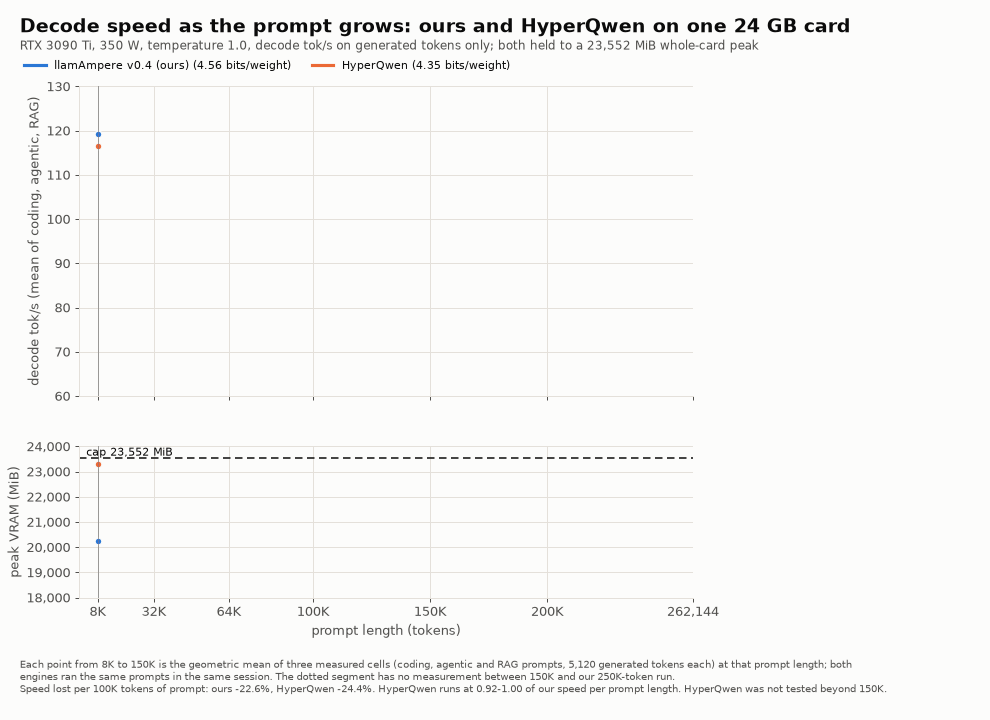
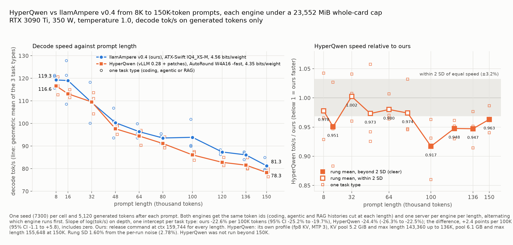
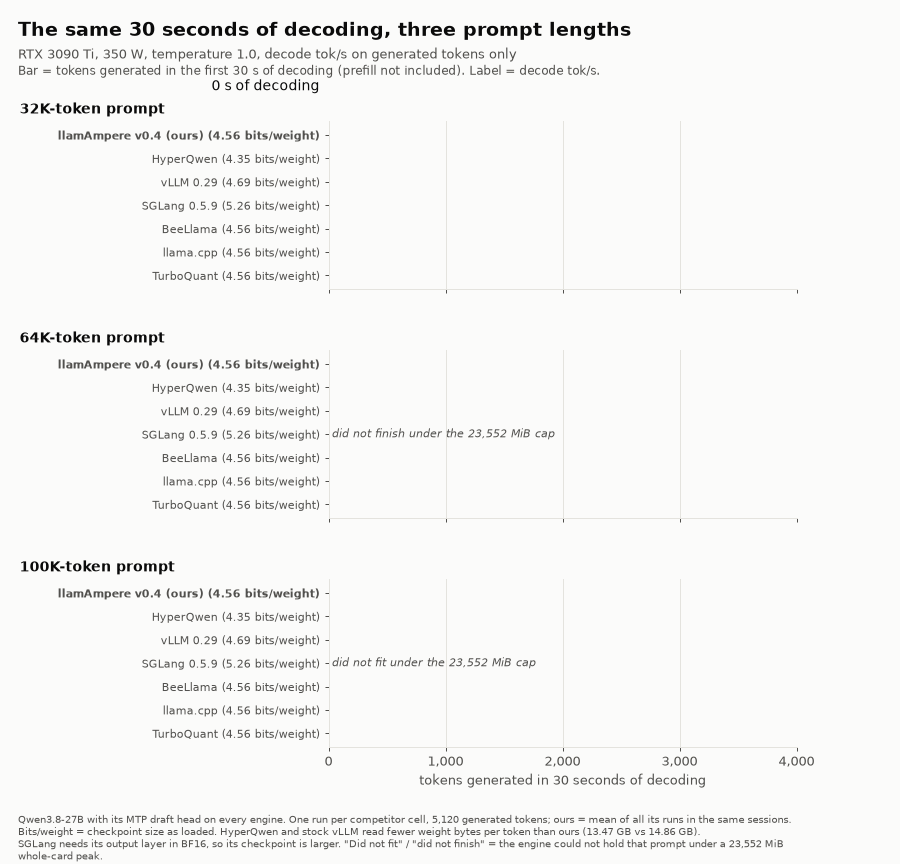
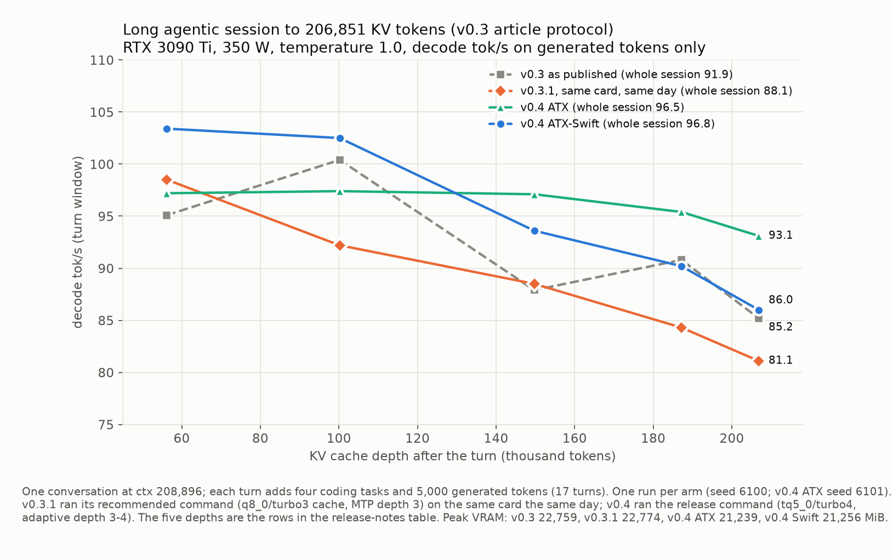
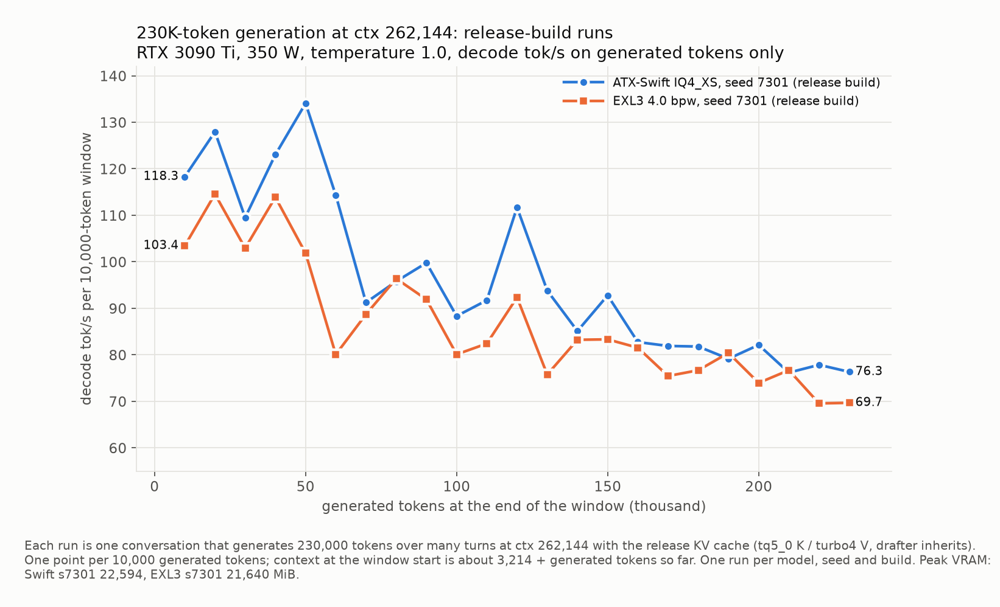
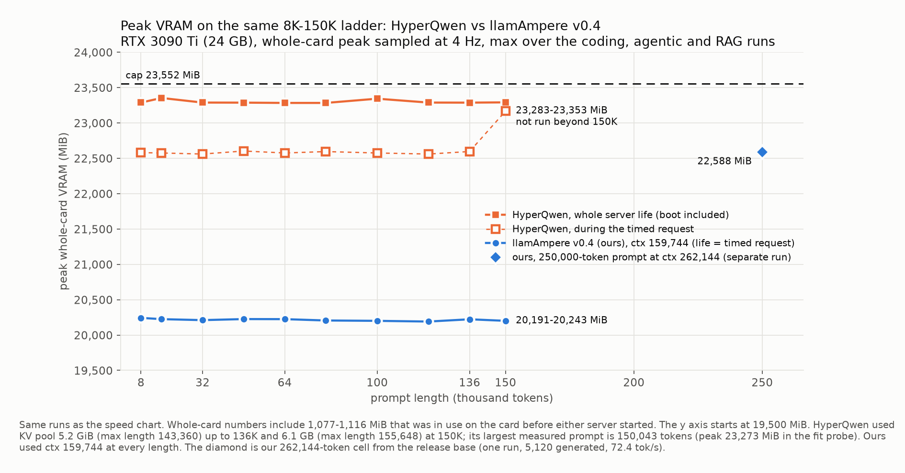

# llamAmpere v0.4 release notes

llamAmpere is a llama.cpp fork tuned for the RTX 3090 / 3090 Ti (Ampere, SM86). It targets Qwen3.8-27B on one card and
uses the model's own MTP draft head for speculative decoding. v0.4 is a speed and long-context release. At 100K depth it
decodes 10.7% faster than v0.3.1's published number and 1.44x as fast as five other engines. A 262,144-token
context fits under 23 GB on IQ4_XS and on EXL3 4.0 bpw. The release also carries a new 5-bit key cache type, verify kernels
for 5 to 8 tokens per pass, draft depth 4 by default (adaptive depth 3-4 as an option), and good defaults for a
launch that passes only `-m`.

## What's new in v0.4

**Speed**

- Verify kernels for 5 to 8 tokens per pass, plus an Ampere routing table that picks the best kernel per weight type
  and width.
- MTP draft depth 4 by default. Adaptive depth 3-4 is available as an option.
- The MTP drafter turns on by itself for Qwen3.8 GGUFs that carry the MTP head, so no drafter flags are needed.
- The drafter's KV cache now uses the same cache types as the main model.
- A built-in draft vocabulary shortlist (`--spec-draft-vocab-map auto`), now on EXL3 too.
- The fused attention tile for q8_0 keys now covers 6 to 8 tokens per pass.
- GDN recurrent-state copies now run as one copy kernel instead of memcpy nodes in the CUDA graph.
- The GDN kernel reads the recurrent state in place instead of gathering a copy every round.
- Fewer copies per decode round: an activation cache for the matrix-vector kernels, a strided copy folded into the
  next kernel, a skipped identity gather and logits pad, and a better launch shape for short concatenations.
- The IQ3 and IQ2 codebook grids are staged in shared memory by default on SM86.
- EXL3 weight-major tensor-core kernels and a fused FFN bridge, both on by default.
- New prefill tiles and a verify-width kernel for PTQ1_0 ternary weights (Ternary Bonsai 2).

**KV cache**

- A new 5-bit key cache type, `turbo5` (tq5_0), with a sign-magnitude encoding.
- Fused attention for turbo4 values paired with turbo5, turbo6 or q8_0 keys, with staged key and value tiles.
- One flat loader for turbo4 keys and values.
- One naming family by bit width, `turbo2` to `turbo6`, with the `tq` spellings accepted in every cache-type flag.
- turbo2 is enforced as values-only.
- Unsupported cache types on Metal, Vulkan and SYCL now fail with a clear error message.

**Long context and memory**

- A 262,144-token context on one 24 GB card, with IQ4_XS and with EXL3 4.0 bpw.
- The prefill attention workspace is capped at 256 MiB by default, and prefill runs in groups.
- The attention scratch buffer is sized for the kernel that actually runs.
- `-fit` accounting fixes: the recurrent state is no longer counted twice, and the adaptive drafter is now budgeted. A
  launch with only `-m` now gets a much larger context.
- An n-gram drafter for cards where the MTP head does not fit, built on a new recurrent-state snapshot ring
  (`--spec-n-rs-seq`).

**Fixes and maintenance**

- tq4_1s weights: fixed NaN from views of weights converted at load time, and the copy abort.
- EXL3: output widths that are not a multiple of 128 no longer abort, and the half-precision accumulation bound is
  corrected.
- HIP: fixed tq5_0 sign packing on 64-wide AMD waves.
- A stress check of the server's cache paths: prompt reuse, branching, restore, cancel, regenerate and slot recycling.
- A catch-up to upstream llama.cpp.

## Recommended settings for 24 GB cards (RTX 3090 / 3090 Ti)

Build as in [QWEN_AMPERE.md](../../QWEN_AMPERE.md#build-and-run). The first five rows below use these flags:

```bash
./build-sm86/bin/llama-server -m <model.gguf> -c <context> \
  -ngl 99 -fa on -ctk turbo5 -ctv turbo4 -b 4096 -ub 1024 -t 8 -tb 8 --parallel 1
```

The MTP drafter, its depth, the vocabulary shortlist and the drafter's cache types are all defaults, so they need no
flags. Pick `-c` for what you run:

| use | model | `-c` | measured decode tok/s | peak whole-card VRAM |
|---|---|---|---|---|
| Everyday coding, agent and RAG work | ATX-Swift IQ4_XS-M | 49152 | 124.2 coding, 119.6 agentic, 115.4 RAG | 17,765-17,790 MiB |
| 100K-token prompts | ATX-Swift IQ4_XS-M | 110592 | 98.2 after a 100K prompt | 19,154 MiB |
| Long multi-turn sessions | ATX-Swift IQ4_XS-M | 208896 | 102.5 at 100K, 86.0 at 206,851 tokens | 21,256 MiB |
| Largest context | ATX-Swift IQ4_XS-M | 262144 | 72.4 after a 250K prompt | 22,588 MiB |
| Largest context, EXL3 | Qwen3.8-27B EXL3 4.0 bpw | 262144 | 61.9 after a 250K prompt | 21,632 MiB |
| No tuning | ATX-Swift IQ4_XS-M | only `-m`; `-fit` picks 61,952 | 112.1 on a 5K request | 23,168 MiB |

- **Where the numbers come from.** RTX 3090 Ti at 350 W, temperature 1.0, 5,120 or more generated tokens. The peaks are
  whole-card, so they include about 1.1 GB that other processes already held on the card. The 49,152 row is the
  release build at its default fixed depth 4. The other rows ran on v0.4 builds from before that default, when it was
  adaptive depth 3-4. The first five rows used the same cache types and flags; the no-tuning row passed only `-m`. The long-session row also used `--cache-ram 0 --ctx-checkpoints 4`.
- **RTX 3090.** It has the same 24 GB, so the same contexts fit. We measured speed on the 3090 Ti only.
- **Cache types.** `-ctk turbo5 -ctv turbo4` is the recommended pair. On 2,400 GPQA and LiveCodeBench answers, its task
  accuracy was not distinguishable from `q8_0/q8_0`. The first five rows were measured with it (see KV cache
  types and naming).
- **Multi-turn chats that edit or regenerate turns.** Add the prompt-cache and checkpoint flags from
  [QWEN_AMPERE.md](../../QWEN_AMPERE.md#build-and-run). They use host RAM, not VRAM.
- **Keep `--parallel 1`.** Every number here is one slot.

## Terms used below

- **MTP draft head.** Qwen3.8 ships a small extra layer that predicts the next few tokens. llamAmpere uses it as a
  built-in drafter. The main model then checks the drafted tokens in one forward pass and keeps the ones it agrees with.
  Checking is exact, so the output follows the main model's distribution.
- **Draft depth.** How many tokens the drafter proposes per step.
- **Verify width.** How many tokens the main model checks in one pass: the drafted tokens plus one.
- **KV cache.** The per-token attention memory the model keeps for the context. Its size grows with the context, so
  compressing it is what makes long contexts fit.
- **GDN state.** Qwen3.8 is a hybrid model. Most of its layers are gated delta-net (GDN) layers, which carry a fixed-size
  recurrent state instead of a KV cache.
- **Ship corpus.** Our task benchmark: real coding, agentic and RAG task histories. Each gate runs 3 seeds (2 where
  stated), temperature 1.0, up to 20,480 generated tokens, and a fresh server per request. "Weighted gain" is
  0.4 x coding + 0.4 x agentic + 0.2 x rag. "±" is two standard deviations across seeds.
- **KL (nats).** The KL divergence of the output token distribution against a reference, measured on generated tokens.
  Lower is closer to the reference.

All speed numbers come from an RTX 3090 Ti at 350 W. Decode tok/s counts generation time only; prefill is reported
separately where measured.

## Headline numbers

Every speed comparison below is at **100K depth**: a 100,000-token prompt followed by 5,120 generated tokens (2,048 for
the v0.3.1 cell), temperature 1.0, one card, 350 W.

- **Against five other engines at 100K:** llamAmpere v0.4 decodes **1.44x** as fast (geometric mean of our speed divided
  by theirs, each engine's 100K cell run next to ours in the same session, one run per engine). Every engine was clearly
  slower than us at 100K. Stock SGLang could not run a 100K context under the 23,552 MiB whole-card cap; its longest
  completed cell (32K) is listed with an asterisk and not counted.
- **Against v0.3.1's published number at 100K:** 103.09 tok/s against 93.16, **+10.7%**.
- **HyperQwen and stock vLLM are the closest, and use more memory.** HyperQwen decoded at 0.927 of our speed at 100K in
  the engine comparison and 0.917 in a separate depth ladder (coding, agentic and RAG prompts at 100K). Stock vLLM 0.29
  decoded at 0.939 of our speed. Both peaked at 22.9-23.3 GB against our 19.2-20.2 GB.

| engine | checkpoint | bits/weight loaded | 100K tok/s, theirs (ours) | our speed / theirs | peak VRAM |
|---|---|---|---|---|---|
| HyperQwen (vLLM 0.28 + patches) | Qwen3.8-27B-W4A16-AutoRound-fast | 4.35 | 90.9 (98.1) | 1.079 | 23,291 MiB |
| stock vLLM 0.29 | same, embedding in BF16 | 4.69 | 92.3 (98.3) | 1.065 | 22,883 MiB |
| BeeLlama | ATX-Swift IQ4_XS-M (same GGUF as ours) | 4.56 | 59.3 (98.3) | 1.657 | 21,412 MiB |
| stock llama.cpp | ATX-Swift IQ4_XS-M | 4.56 | 58.2 (98.2) | 1.688 | 21,748 MiB |
| TurboQuant | ATX-Swift IQ4_XS-M | 4.56 | 50.2 (98.2) | 1.959 | 20,868 MiB |
| stock SGLang 0.5.9 | same as vLLM, output layer and MTP input projection also in BF16 | 5.26 | 69.7 (119.2) at 32K\* | 1.710\* | 22,874 MiB\* |
| **geometric mean (five that fit 100K)** | | | | **1.445** | |

\* SGLang's longest completed cell is a 32,000-token prompt (5,120 generated). A 100K context does not fit under the
23,552 MiB cap: at ctx 110,592 its KV pool holds about 76,000 tokens. At 64K, the pool left room for only 147 generated
tokens, so that cell did not finish. Its 32K cell is not in the 100K geometric mean.

Our peak at 100K was 19,154 MiB with a 110,592-token context allocated.

Shorter prompts: some engines come closer at short lengths and then fall away with depth. HyperQwen and stock vLLM were
level with us within run-to-run noise at 64K, and HyperQwen was level at 32K on the depth ladder (1.002 of our speed).
No engine in these comparisons was faster than us beyond run-to-run noise at any prompt length, from 8K to 150K.

Some engines also ship profiles tuned for shorter contexts (up to a 64K window); we are testing those separately. The
configurations shown here are the fastest we could run at 100K+ context on this card.

Stock vLLM and SGLang can't load HyperQwen's int8 embedding, so their copies store it in BF16; SGLang 0.5.9 also has no
quantized path for the output layer and skips the int4 MTP input projection, so those two layers are BF16 there
(dequantized exactly from the int4 values). The trunk weights are the same int4 values in all three.

The referenced model is ATX-Swift (`jakeatx/ATX-Swift-Qwen3.8-27B-Uncensored-IQ4_XS-M-GGUF`). It uses the same IQ4_XS-M
recipe and MTP head as plain ATX. On the same build it reads +1.14% ± 0.56% against plain ATX (ship corpus, 3 seeds).

**Against v0.3.1 at 100K.** Protocol as v0.3.1 published it: a 100,000-token prompt, ctx 106,496, 2,048 generated,
temperature 1.0, seed 6100. The cache is turbo5 (tq5_0) keys with turbo4 values, on both the main model and the drafter.
This cell ran with adaptive draft depth 3-4, the default when it was measured; the release default is now fixed depth 4
(see Speculative decoding).

| cell | v0.4 tok/s (draft acceptance) | v0.3.1 published | change | v0.4 peak VRAM |
|---|---|---|---|---|
| 100K depth | 103.09 (0.799) | 93.16 | +10.7% | 19,291 MiB |

**262,144-token context.** Each cell used a 250,000-token prompt, generated 5,120 tokens, ran one seed, and used the same
KV cache as above. All three fit under the 23,552 MiB budget.

| model | decode tok/s (acceptance) | peak VRAM | margin |
|---|---|---|---|
| ATX IQ4_XS | 64.4 (0.636) | 22,588 MiB | 964 MiB |
| ATX-Swift IQ4_XS | 72.4 (0.745) | 22,588 MiB | 964 MiB |
| EXL3 4.0 bpw | 61.9 (0.692) | 21,632 MiB | 1,920 MiB |

**Long sessions against the last release.** This is the same test the v0.3 article published: one agentic
conversation at ctx 208,896 that adds four new coding tasks and 5,000 generated tokens per turn until the context is
full (17 turns, KV cache at 206,851 tokens). Temperature 1.0. v0.3.1 ran with its own recommended command (q8_0/turbo3 cache,
MTP depth 3) on the same card the same day; v0.4 ran with the release command. One run each. Turns from 100K up:

| KV depth | v0.3 as published | v0.3.1, same card | v0.4 ATX | v0.4 ATX-Swift |
|---:|---:|---:|---:|---:|
| 100,201 | 100.4 | 92.2 | 97.4 | 102.5 |
| 149,743 | 87.9 | 88.5 | 97.1 | 93.6 |
| 187,185 | 90.8 | 84.3 | 95.4 | 90.2 |
| 206,851 | 85.2 | 81.1 | 93.1 | 86.0 |
| last five turns | 88.6 | 82.2 | 93.8 | 88.6 |
| peak VRAM | 22,759 MiB | 22,774 MiB | 21,239 MiB | 21,256 MiB |

At 100K on the same card, v0.4 is 5.6% (ATX) and 11.2% (ATX-Swift) faster than v0.3.1, and 14.2% and 7.8% faster over
the last five turns, while using about 1.5 GB less VRAM.

**230K generation.** Each run is one conversation that generated 230,000 tokens over many turns, at ctx 262,144 with the
release KV cache. The last full window is the final 10,000 generated tokens before the context filled.

| run | last full window tok/s | peak VRAM |
|---|---|---|
| ATX-Swift, seed 7301 (release build) | 76.3 | 22,594 MiB |
| ATX-Swift, seed 7300 (pre-release build) | 76.2 | 23,479 MiB |
| EXL3 4.0 bpw, seed 7301 (release build) | 69.7 | 21,640 MiB |
| EXL3 4.0 bpw, seed 7300 (pre-release build; stopped at 214,714 tokens, see Known limits) | 59.3 | 22,705 MiB |

**Production command.** The drafter, its depth policy (fixed depth 4, p-min 0) and the drafter cache types are now
defaults for Qwen3.8 models with an MTP head, so they no longer need to be spelled out. Fixed depth 4 became the default
in the release build (commit 01940bd20):

```bash
./build-sm86/bin/llama-server -m ATX-Swift-Qwen3.8-27B-Uncensored-IQ4_XS-M.gguf \
  -c 49152 -b 4096 -ub 1024 -t 8 -tb 8 -ngl 99 -fa on -ctk turbo5 -ctv turbo4 --parallel 1
```

When the default was adaptive 3-4, it gave identical text and acceptance to the same settings passed explicitly on 3
seeds. The v0.3.1 flags still work.

## Charts

Every value in these charts is a measured cell.

- Speed as the prompt grows, ours and HyperQwen, 8K to 150K plus our 250K-token run (animated; also
  `CHARTS/anim_speed_decline.mp4`): 
- The same curve with HyperQwen's speed as a fraction of ours at each prompt length:
  
- The same 30 seconds of decoding at 32K, 64K and 100K-token prompts, all engines (animated; also
  `CHARTS/anim_race.mp4`): 
- Long session to 206,851 KV tokens: 
- 230K generation, release build: 
- Peak whole-card VRAM, ours and HyperQwen, 8K to 150K: 

## Speed

- **Verify kernels for 5 to 8 tokens per pass.** Before v0.4, checking 5 tokens cost far more than checking 4 on IQ4_XS,
  which capped the useful draft depth at 3. v0.4 adds matrix-vector kernels for widths 5-8 and an Ampere routing table.
  q4_K, q5_K and q6_K use the tile kernel above width 4; every other type stays on the vector kernel through width 8.
  - Same fixed depth-4 flags on the v0.3.1 and v0.4 builds, identical token streams: coding 98.2 to 104.1, agentic 95.0
    to 101.4, rag 93.4 to 101.1 tok/s. Weighted gain +6.70% ± 0.42%.
  - After a 50K prompt: +3.93%. After a 64K prompt: +3.37%.
- **Fused attention now covers widths 6-8.** The fused attention tile for q8_0 keys now covers widths 6-8 by default.
  Before, those widths fell back to a slower unfused path. At 100K KV depth, a width-8 attention call takes 429 µs
  instead of 1,434 µs. `GGML_Q8_TURBO3_MMA_MAX_Q=5` restores the old routing.
- **Cheaper GDN state copies.** The recurrent-state ring copies inside each decode round now run as a copy kernel
  instead of as device-to-device memcpy nodes in the CUDA graph. With this change, a fixed-depth-3 round on v0.4 takes
  29.45 ms against 30.81 ms on v0.3.1 (-4.4%), with identical output. `GGML_CUDA_CPY_MEMCPY=1` and
  `LLAMA_RS_RING_ROWS=1` restore the old paths.
- **Fewer copies per round.** This group of changes brought +1.85% ± 0.10% (2 seeds) with the same token stream in every
  pair. It contains:
  - a two-entry activation cache for the matrix-vector kernels;
  - a strided copy folded into the next elementwise kernel;
  - skipping an identity gather and a dummy logits pad;
  - a better launch shape for short-row concatenation.
- **GDN state read in place.** Each verify round used to gather the recurrent state of 48 layers (3 MB per layer) into a
  contiguous copy. The GDN kernel now reads the state where it lives.
  - Weighted gain +1.00% ± 0.04% (2 seeds), identical token streams.
  - Per-round time 29.06 ms against 29.38-29.41 ms without it.
  - `GGML_CUDA_GDN_STATE_READ=0` restores the old path.

## Long context and memory

- **Bounded prefill workspace.** At prefill, flash attention used to reserve full f16 copies of K and V for the whole
  context. That is why ATX did not fit at 262,144 tokens. The workspace is now capped at 256 MiB by default
  (`GGML_CUDA_PREFILL_KV_MIB`; `0` or `off` restores the old behaviour), and prefill runs in groups.
  - Measured at ctx 262,144 with the heaviest drafter cache (f16): the card peaks at 23,274 MiB. Without the cap it
    peaks at 23,959 MiB, which is over budget.
  - KL against the unbounded route: 0.000000 nats.
  - Prefill is 1.5% slower at the 256 MiB budget. Decode is unchanged.
  - Prefill graphs larger than the budget run without CUDA graph capture. Decode graphs are unaffected.
- **Attention scratch sized by route.** The flash-attention compute buffer is now sized for the kernel that actually runs.
  Fused routes no longer reserve f16 K/V copies they never use. Output is byte-identical. `GGML_CUDA_FATTN_ALLOC_ROUTE=0`
  restores the old sizing.
- **`-fit` accounting fixes.**
  - The adaptive MTP drafter's context was not budgeted at all; it is now.
  - The draft context is measured once at 4,096 tokens and only its KV cache is scaled, instead of being measured at every
    probe size. `LLAMA_SHARED_COMPUTE=0` restores the old accounting.
  - The GDN recurrent state was counted twice (2,992.5 MiB on Qwen3.8-27B). It is now sized, not allocated, during the
    fit probe.
  - Result on ATX-Swift launched with only `-m`, with the drafter: context 15,616 before and 61,952 after, 112.06 tok/s on
    a 5K request, 101.72 at 60,652 deep, peak 23,168 MiB.
  - The same launch with `--spec-type none`: context 99,072 before and 108,544 after, peak 23,162 MiB.
- **Smaller cache.** tq5_0 keys with turbo4 values take 9.25 bits per K+V element, against 11.625 for the v0.3
  q8_0/turbo3 pair. See the next section.

## KV cache types and naming

- **New key type: tq5_0.** This is a 5-bit TurboQuant key cache (ggml type id 59). It replaces tq6_0 as the
  memory-saving key option: it is smaller and faster.
  - Quality: +0.0002 to +0.0005 nats KL over q8_0 keys at depths from 10K to 147K.
  - A sign-magnitude re-encoding of the same type is bit-exact and brought +0.75% weighted gain.
- **Fused attention for turbo4 values.** The fused kernel covers turbo4 values paired with tq5_0, tq6_0 or q8_0 keys,
  plus the tq6_0/tq5_0 pair. Value tiles are staged for turbo3, q8_0 and turbo4 values. At 100K the tq5_0/turbo4 pair went
  from about 16 tok/s unfused to 79 tok/s with MTP (diagnostic cell).
- **Key-only staging** for tq5_0 values: +1.8-1.9% at 100K on pairs with tq5_0 values.
- **turbo4 flat loader.** turbo4 keys, and turbo4 values behind any key type, now use one loader. Output is
  bit-identical. `GGML_CUDA_TURBO4_FLAT_ALL=0` restores the old loader.
- **tq5_0/turbo4 against q8_0/turbo3 (the v0.3 pair).**
  - KL: 0.00155-0.00241 nats against 0.00362-0.00455 at 10K-77K.
  - Speed: level on the ship corpus (+0.23% ± 1.98%). After a 64K prompt: 85.8 vs 85.9 tok/s, with a peak of 19,114 vs
    19,506 MiB.
  - tq5_0 keys alone, on the older unfused path, were 2.3% / 4.1% slower than q8_0 keys at 65K / 102K.
- **Task accuracy.** 2,400 GPQA and LiveCodeBench answers. No cache pair differs from q8_0/q8_0 at 95% confidence:
  - tq5_0/turbo4: +1.2 points;
  - tq6_0/turbo3: 0.0 points;
  - q8_0/turbo3: -1.0 points.
- **KL by depth for the other types.** Measured from 10K to 147K on generated tokens only:
  - q8_0/q8_0: 0.0003 nats;
  - turbo4 values: 0.0011-0.0015 nats;
  - turbo3 values: 0.0033-0.0045 nats, flat with depth;
  - tq6_0 keys: the same as q8_0 keys.
- **turbo2 is values-only.** A turbo2 key request is rejected when the context is created. The auto-asymmetric rewrite
  now applies only to turbo3 keys.
- **Clear error for unsupported cache types.** Some devices have no write kernel for the requested cache type, for
  example tq5_0 or tq6_0 on Metal, Vulkan or SYCL. Context creation now fails with a message that names the type and the
  device and suggests `-nkvo`, instead of aborting later in the scheduler.
- **Docs.** The bits per value for turbo2, turbo3 and turbo4 are corrected to 2.125, 3.125 and 4.125.
- **One naming family by bit width.** The TurboQuant cache types are now named `turbo2` to `turbo6`, and the `tq`
  spellings work too, in every flag that takes a cache type (`-ctk`/`-ctv`, `-ctkd`/`-ctvd`, `llama-bench`). Case does not
  matter.

  | bits | name | also accepted | printed in logs |
  |---|---|---|---|
  | 2 (values only) | `turbo2` | `tq2` | `turbo2` |
  | 3 | `turbo3` | `tq3`, `tq3_0` | `turbo3` |
  | 4 | `turbo4` | `tq4`, `tq4_0` | `turbo4` |
  | 5 | `turbo5` | `tq5`, `tq5_0` | `tq5_0` |
  | 6 | `turbo6` | `tq6`, `tq6_0` | `tq6_0` |

  `tq2_0` is not accepted as a cache type because it is ggml's ternary weight type; the error points to `turbo2`.

## Model formats

- **EXL3 (Turboderp's exllamav3 trellis format as GGUF-native types).**
  - Weight-major tensor-core matrix-vector products and a fused FFN bridge are now on by default. The bridge runs
    glue-out, SwiGLU and glue-in in one kernel. A decode round takes 34.98 ms instead of 35.85 ms (-2.46%), with
    identical output. `GGML_CUDA_EXL3_WEIGHT_MAJOR=0` and `GGML_CUDA_EXL3_FFN_BRIDGE=0` turn them off.
  - The half-precision accumulation bound is corrected. On the coding, agentic and RAG task prompts (5,120 generated
    each), the largest staged value was 0.029 against a bound of 256. None of 60 billion values exceeded the bound, and
    there were no non-finite outputs.
  - We extended compact draft head vocab mapping to EXL3. The drafter now scores a 65,536-token shortlist on EXL3 as it
    does on IQ4_XS, which raises draft acceptance.
  - 262K fits at 21,632 MiB (table above).
  - On the ship corpus (2 seeds), v0.4 reads 107.9 / 106.8 / 101.9 tok/s (coding / agentic / rag) against v0.3.1 at
    fixed depth 4 with 96.1 / 92.4 / 90.6, run on the same card in the same window. Weighted gain +13.6% ± 7.1%.
  - After a 100K prompt (5,120 generated), v0.4 reads 84.1 and 87.7 tok/s on two seeds against 79.4 and 77.6 on v0.3.1
    at fixed depth 4 (+5.8% and +13.1%), with about 600 MiB less peak VRAM (18,430 against 19,028 MiB).
- **TurboQuant weights (tq4_1s).** Fixed: views of tq4_1s weights that were converted to q8_0 at load time read the
  converted bytes as tq4_1s. This gave NaN, for example in GET_ROWS. A view made before the conversion now keeps its base
  in native tq4_1s, and a view made after it is rewritten to the q8_0 layout. In-place copies keep both of their tq4_1s
  tensors in the same format, so they do not reach the "q8_0 to tq4_1s" copy abort. Commits dd38cab0b and 2db1a928d.
  `GGML_TQ_NATIVE=1` still skips the conversion.
- **IQ3 and IQ2.** The codebook grid is now staged in shared memory by default on SM86.
  - IQ3 at widths 1-4: 1.8% to 14.6% faster per kernel, +0.6% end to end at width 1.
  - IQ2: iq2_xxs and iq2_xs are 4-9% faster at all widths; iq2_s uses it at widths 2-5.
- **PTQ1_0 ternary weights (Ternary Bonsai 2).** New prefill tiles. On Ternary-Bonsai-2-27B, prefill goes from 846 to
  1,148 tok/s at 512 tokens and from 815 to 1,126 at 16K. A verify-width kernel for PTQ1_0 is also included.
- **Weight bit-width KL sweep.** We measured 15 weight quantizations against BF16. Below 4.3 bits per weight, EXL3 had
  lower KL than the i-quant GGUFs we tested.

## Speculative decoding (drafter)

- **MTP drafter on by default for Qwen3.8.** For models of the `qwen35` architecture whose GGUF carries an MTP head, the
  drafter now starts by default with fixed draft depth 4 and p-min 0 (`--spec-type draft-mtp --spec-draft-n-max 4
  --spec-draft-p-min 0`). It turns off when you pass
  any `--spec-type` (including `none`), a draft model or `--eagle3`. Explicit `--spec-draft-*` values apply
  on top of it. With the earlier adaptive 3-4 default, a launch with only `-m` decoded at 111-112 tok/s on a 5K
  request, against about 50 without the drafter.
- **Draft depth 4, and why it now beats depth 3.** In earlier releases we tested depth 4 and kept depth 3. On real
  prompts at temperature 1.0, depth 3 was 1.9% faster, even though every greedy fixture preferred depth 4 (up to +17%
  on rag).
  - **Why depth 3 won before.** A depth-4 draft means checking 5 tokens per pass (width 5) instead of 4. At temperature
    1.0, depth 4 returns 12-19% more tokens per step, because each extra draft is accepted less often than at greedy.
    That only pays if a width-5 pass costs less than 12-19% more than a width-4 pass. Before v0.4 it cost more: width 5
    fell off the tuned matrix-vector kernels.
  - **What changed.** v0.4's width 5-8 verify kernels (see Speed) removed that cost. Run on the same depth-4 settings,
    v0.4 is 6.70% ± 0.42% faster than v0.3.1 with identical token streams and identical acceptance, so the gain is all
    step cost. On v0.4, a width-5 step costs 1.10-1.12x a width-4 step (26.2-27.7 against 29.3-31.0 steps per second on
    the ship corpus).
  - **Result.** At that cost, the extra tokens per step win. Depth 4 beats depth 3 by +3.55% ± 1.41% on the ship corpus
    (coding, agentic and rag, 3 seeds, temperature 1.0). Tokens per step rise from 3.2-3.4 to 3.6-4.0, and steps per
    second fall from about 30.5 to about 27.1.
- **Fixed depth 4 (the default) and adaptive depth 3-4 (an option).** Adaptive 3-4 proposes 4 tokens after a run of
  fully accepted drafts and drops to 3 after misses. Fixed depth 4 always proposes 4.
  - At introduction, adaptive 3-4 read +2.15% ± 1.92% over fixed depth 4. On a later build, fixed depth 4 read
    +1.16% ± 1.92% over adaptive 3-4.
  - **Release-candidate gate (2026-09-28).** Fixed depth 4 against adaptive 3-4 on ATX-Swift, ship corpus, 3 seeds,
    temperature 1.0, same build and same flags except the depth policy. Fixed depth 4 read **+1.50%** weighted gain with
    two standard errors of 1.16%, which passes the ship rule (mean gain above two standard errors).
    - Per task, adaptive 3-4 to fixed 4: coding 123.55 to 124.19, agentic 117.08 to 119.62, rag 113.09 to 115.42 tok/s.
    - Per seed: +2.62%, +1.19%, +0.68%.
    - Tokens per pass rose from 3.53-3.94 to 3.71-4.01; passes per second fell from 31.4-32.0 to 31.0-31.3. Adaptive
      ran 13-33% of its rounds at depth 3 (coding 13%, agentic 23%, rag 33%).
    - Peak VRAM was 17,765-17,790 MiB across both arms at ctx 49,152.
    - Repeat runs of the adaptive arm at the start and end of the gate read -0.76% and -0.02% against their in-gate
      cells, with identical text.
    - Chart: `CHARTS/chart7_depth4_vs_adaptive.png`.
  - The two gate commands (a release-candidate build; they differ only in the `--spec-*` depth flags):

    ```bash
    # adaptive 3-4
    ./build-sm86/bin/llama-server -m ATX-Swift-Qwen3.8-27B-Uncensored-IQ4_XS-M.gguf \
      -c 49152 -b 4096 -ub 1024 -t 8 -tb 8 -ngl 99 -fa on -ctk tq5_0 -ctv turbo4 --parallel 1 \
      --spec-type draft-mtp-adaptive --spec-draft-n-max 4 --spec-draft-n-min-adaptive 3 --spec-draft-p-min 0 \
      --spec-draft-type-k tq5_0 --spec-draft-type-v turbo4 --spec-draft-vocab-map docs/mtp-vocab/atx_65536.txt

    # fixed depth 4
    ./build-sm86/bin/llama-server -m ATX-Swift-Qwen3.8-27B-Uncensored-IQ4_XS-M.gguf \
      -c 49152 -b 4096 -ub 1024 -t 8 -tb 8 -ngl 99 -fa on -ctk tq5_0 -ctv turbo4 --parallel 1 \
      --spec-type draft-mtp --spec-draft-n-max 4 --spec-draft-p-min 0 \
      --spec-draft-type-k tq5_0 --spec-draft-type-v turbo4 --spec-draft-vocab-map docs/mtp-vocab/atx_65536.txt
    ```
  - **Default: fixed depth 4** (chosen on the gate above). The release build (commit 01940bd20) applies it when no `--spec-type` is given. Adaptive 3-4 stays available with
    `--spec-type draft-mtp-adaptive --spec-draft-n-max 4 --spec-draft-n-min-adaptive 3 --spec-draft-p-min 0`.
    On the release build, the plain production command (no `--spec-*` flags, so the vocab map is `auto` and the drafter
    cache inherits tq5_0/turbo4) gave byte-identical text to the fixed-depth-4 flags passed explicitly (coding, seed
    7300, 20,480 tokens): 125.4 against 124.2 tok/s, peak 17,766 MiB.
- **Why depth 5 does not win yet.** Depth 5 has the same trade-off as depth 3 against depth 4, but so far the cost side
  wins.
  - Measured on the ship corpus (3 seeds, temperature 1.0) against adaptive 3-4:
    - adaptive 3-5: -1.84% ± 1.80%;
    - adaptive 4-5: -1.48% ± 0.65%.
  - On the release build, fixed depth 5 read -1.66% ± 1.20%. That comparison ran with the drafter's sampling
    temperature halved on both arms, part of a separate draft-temperature test.
  - What the fifth draft buys: tokens per pass rose from 3.56-3.94 to 3.71-4.35, about 5-10%. A fifth draft only counts
    when the first four were all accepted. Per-draft acceptance also fell, from 0.69-0.76 to 0.63-0.72.
  - What it costs: one more drafter step and a sixth row in every check. Passes per second fell from 26.2-26.9 to
    23.5-25.2, about 7-10%.
  - Why it may never win: each extra draft is worth less than the one before it, because it needs every earlier draft
    accepted, while each one adds a roughly fixed cost. Depth 5 wins only if a 6-token check becomes nearly as cheap as
    a 5-token one. That is the goal of the width-flat verify and attention kernels planned for v0.5; we will re-test
    depth 5 when they land. If they don't get there, depth 4 stays the fastest setting on this card.
- **Drafter KV cache follows the main model.** Unless `--spec-draft-type-k/-v` are given, the drafter's cache now takes
  the main model's `-ctk`/`-ctv` types (before, it defaulted to f16). Before this change the drafter proposed from a
  history in one format while the main model checked against another.
  - Changing a q8_0/q8_0 drafter cache to match a tq5_0/turbo4 main cache, one run each in the same window:
    - agentic shard 1: acceptance 0.682 to 0.763, 94.56 to 100.71 tok/s (+6.5%);
    - 100K depth: acceptance 0.735 to 0.798, 88.18 to 99.01 tok/s (+12.3%).
  - At ctx 262,144 after a 100K prompt, the matched cache peaked at 23,366 MiB against 23,615 MiB for a q8_0/q8_0
    drafter cache (pre-release build).
- **N-gram drafter for cards where the MTP head does not fit.** `--spec-type ngram-cache` with n-max 3 is the low-VRAM
  setting.
  - On an IQ3_S GGUF of Qwen3.8-27B, starting with no cache file: +16.40% ± 1.57% against no drafter (n-max 7: +9.66% ±
    1.70%).
  - It relies on a new recurrent-state snapshot ring. The ring moves a base index instead of copying about 142 MiB of
    state per group, and keeps snapshots for partial draft acceptance. `--spec-n-rs-seq N` sets the number of snapshots
    per sequence; the default derives it from the drafter.

## Server and usability: defaults that changed

| default | now | how to get the old behaviour |
|---|---|---|
| MTP drafter for Qwen3.8 with an MTP head | on, fixed draft depth 4, p-min 0 | `--spec-type none` or any explicit `--spec-type`; adaptive 3-4: `--spec-type draft-mtp-adaptive --spec-draft-n-max 4 --spec-draft-n-min-adaptive 3 --spec-draft-p-min 0` |
| Drafter KV cache types | same as `-ctk`/`-ctv` | `--spec-draft-type-k/-v f16` |
| Prefill attention workspace | capped at 256 MiB | `GGML_CUDA_PREFILL_KV_MIB=0` |
| Attention scratch sizing | follows the kernel route | `GGML_CUDA_FATTN_ALLOC_ROUTE=0` |
| turbo4 loader | one flat loader | `GGML_CUDA_TURBO4_FLAT_ALL=0` |
| Fused q8_0-key attention tile | widths up to 8 | `GGML_Q8_TURBO3_MMA_MAX_Q=5` |
| GDN state read | in place | `GGML_CUDA_GDN_STATE_READ=0` |
| EXL3 weight-major kernels and FFN bridge | on | `GGML_CUDA_EXL3_WEIGHT_MAJOR=0`, `GGML_CUDA_EXL3_FFN_BRIDGE=0` |
| IQ3 / IQ2 codebook grids on SM86 | staged in shared memory | not switchable |

Other changes:

- **Stress check of the server.** We ran 81 cache-state cells on the production MTP setup: cold start, exact and partial
  prompt reuse, a diverging branch, restore, cancel, regenerate, a recycled slot and memory pressure.
  - Every cell stayed within -2.3% to +3.7% of its cold cell's decode speed, paired by seed.
  - Peak VRAM was 21,070 MiB.
  - Cancel frees the slot in 0.10 s.
- **Opt-in switches, measured, off by default.**
  - `GGML_CUDA_ADD_RMS_Q8=1` fuses add, rms_norm, mul and the q8_1 quantize at prefill. Prompt processing is +0.9% at 8K
    and +0.6% at 32K, with identical output.
  - `GGML_CUDA_MMVQ_THIN=<rows>` runs a thin matrix-vector launch for few-row matrices. Per-round time is -0.6%, inside
    card noise. KL is equal (0.00053 vs 0.00057 nats), but the output is not bit-identical.
  - `LLAMA_GDN_INGR_COMPACT=1` compacts the replay ingredients. No speed gain measured.
  - `LLAMA_SPEC_DRAFT_TEMP_MULT=<x>` samples the drafter at a lower temperature than the main model. We tried 0.5 to 0.9
    on the ship corpus (3 seeds). None beat the default; the best, 0.5, then read -0.2% at 100K, -8.5% at 262K, and
    -0.7% and -0.4% on the ATX and EXL3 ship corpora.

## Bug fixes

- **tq4_1s weights.** Views of weights converted at load time read garbage (NaN in GET_ROWS). In-place copies between
  tq4_1s tensors now keep both sides in one format, so they do not reach the "q8_0 to tq4_1s" copy abort. Commits
  dd38cab0b and 2db1a928d.
- **EXL3 matrix-vector products** whose output width is not a multiple of 128 aborted. They now sum the split-K partials
  per element. The opt-in fused path used to leave the last outputs of such shapes unwritten; it now falls back.
  Production shapes keep the unchanged path. The EXL3 matmul tests pass 158/158 on all four paths, and EXL3 FFN 22/22.
- **`-fit`** counted the GDN recurrent state twice and did not budget the adaptive MTP drafter (see Long context and
  memory).
- **tq5_0 on 64-wide AMD waves.** The tq5_0 cache writer packed sign bits with a 32-bit ballot, which corrupts half the
  signs on wave64 HIP. HIP builds now use width-32 shuffles. This fix is compile-checked only; we have no AMD hardware.
- **Unsupported KV cache types** on Metal, Vulkan or SYCL now fail at context creation with a clear message instead of
  aborting in the scheduler.

## Tried, measured, not shipped

- **Adaptive depth 3-5 and 4-5:** -1.84% ± 1.80% and -1.48% ± 0.65% against adaptive 3-4. There were more tokens per
  pass, but acceptance was lower and the width-6 verify was slower.
- **Cost-aware adaptive depth:** it never switched away from depth 4 (+0.74%, noise).
- **Replicated bank-offset IQ3 grid:** -5% to -22% per kernel and -8.5% end to end. The copy costs more than the bank
  conflicts it removes.
- **Tile kernel (MMQ) for i-quants at widths 5-8:** 20-36% slower than the vector kernels at width 5.
- **MMQ at occupancy 2 for iq4_xs and q5_0:** 22% slower at width 4 and level at width 8; the replication read 10-28% slower.
- **IQ4_XS int8 tensor-core verify kernel:** level with the vector kernel at widths 3-5, 10-14% faster at widths 6-8 and
  10% slower at width 2. It pays only with a deeper draft. Adaptive 4-5 with the kernel read +0.75% ± 0.48% in the first
  gate and +0.31% ± 2.94% in the 3-seed replication.
- **First n-gram drafter attempt:** -10.4% and -11.5%. The cause was the old snapshot copy, not the drafter; the ring fix
  above turned it into +16.40%.
- **tq6_0 keys as the default:** quality equal to q8_0 keys but 5.4% / 7.6% slower at 65K / 100K. tq5_0 replaced it.
- **Key staging for tq6_0 values:** -0.5% in two runs.
- **GDN replay rollback (`--gdn-replay`) as the default:** -4.31% ± 0.39% against the snapshot ring, to save 84 MiB. It
  stays opt-in.
- **GDN fused verify kernel:** bit-exact in its unit test, but its graph matcher never engaged on the final tree
  (-0.02%, byte-identical). Its gain is unmeasured, so it was dropped from this release.
- **Graph-input packing and per-input sync skip:** +0.08%, -0.47% and +0.13% against the base, with identical output.

## Known limits

- **EXL3 long session.** In one of the two 230K runs (seed 7300, pre-release build), turns past about 205K context
  collapsed: 99% of them ended inside the thinking block or with an empty answer. The other run (seed 7301, release
  build) reached 230,000 tokens, and 10 of its 11 turns past 200K ended with a complete answer. With one run per seed and
  build, we cannot yet tell a numeric problem at depth apart from the model reacting to its own earlier output.
- **Early end-of-turn in the middle of code.** Before 200K, turns end mid-code at the same rate on EXL3, ATX and Swift
  (61-73% of turns that ended on end-of-turn). This is not specific to one format.
- **Long-session curves.** The 230K curves cover ATX-Swift and EXL3 only.
- **Drafter cache default.** The drafter-cache default is backed by single-run, same-window pairs. The 3-seed ship-corpus
  gate was not run with it.
- **Platforms not run.**
  - The Vulkan TurboQuant port is unverified; no Vulkan run.
  - The HIP wave64 fix is compile-checked only.
- **PTQ1_0.** Greedy text after a 16K prefill differs from v0.3.1 at a near-tie after about 130 tokens, because stream-K
  partitions changed. The PTQ1 matmul tests pass.
- **Test harness.** `test-generate-models` aborts on the deepseek32 tiny model before writing some fixtures. This does
  not touch Qwen3.8; its tests run directly.

## Attribution and licenses

- llama.cpp and ggml are ggml-org's (MIT).
- The TurboQuant KV cache types and TurboQuant weight types (tq3_1s, tq4_1s) come from TheTom's TurboQuant fork of
  llama.cpp.
- The EXL3 format, the trellis codebooks and their arithmetic are Turboderp's exllamav3.
- Ternary Bonsai 2 is Prism ML's.
